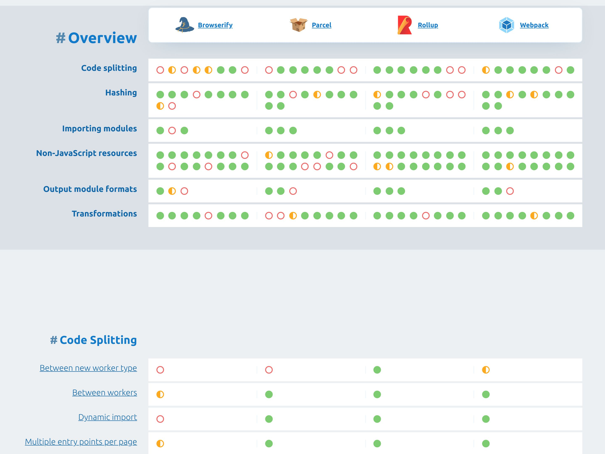
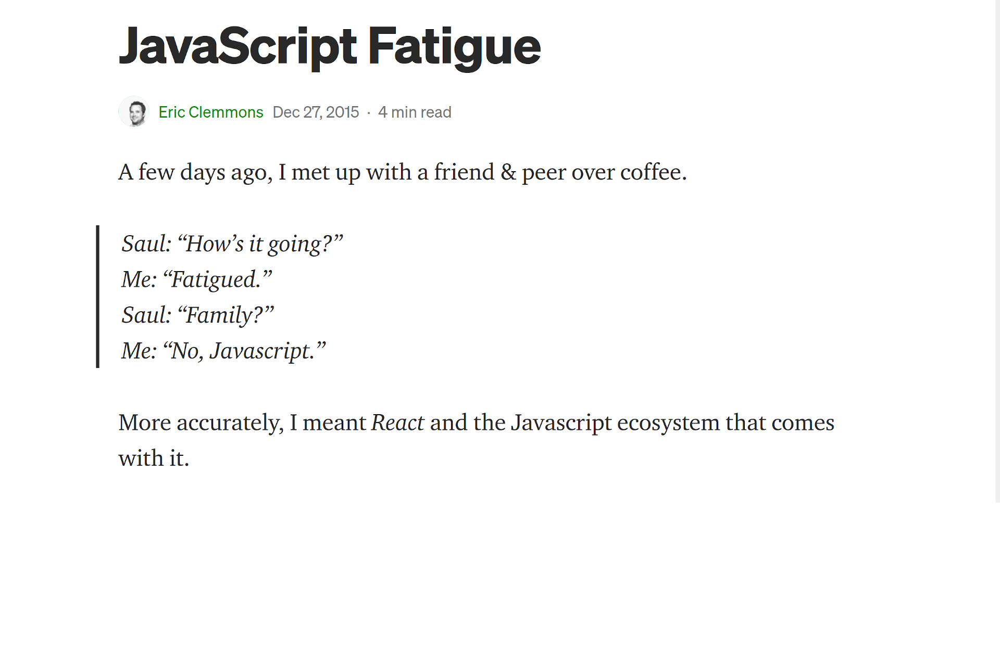
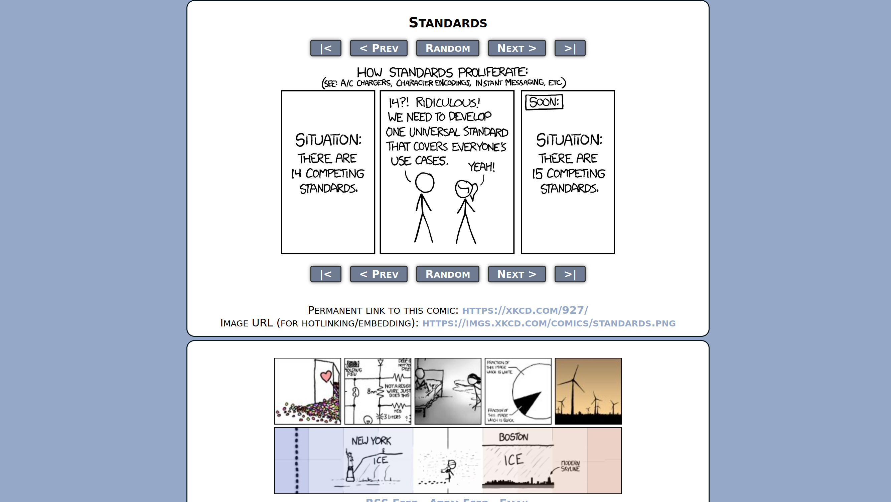
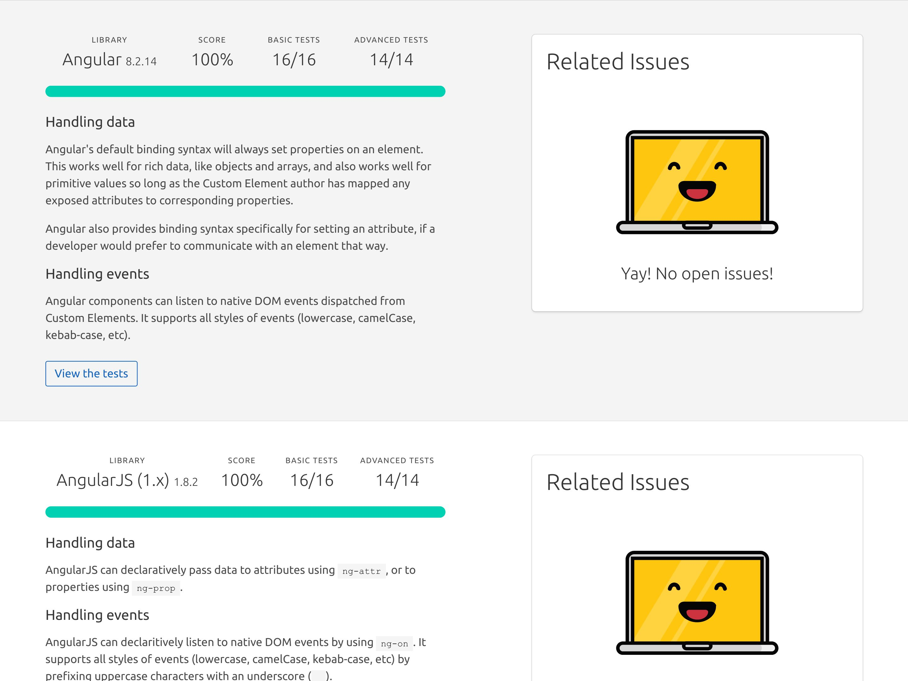
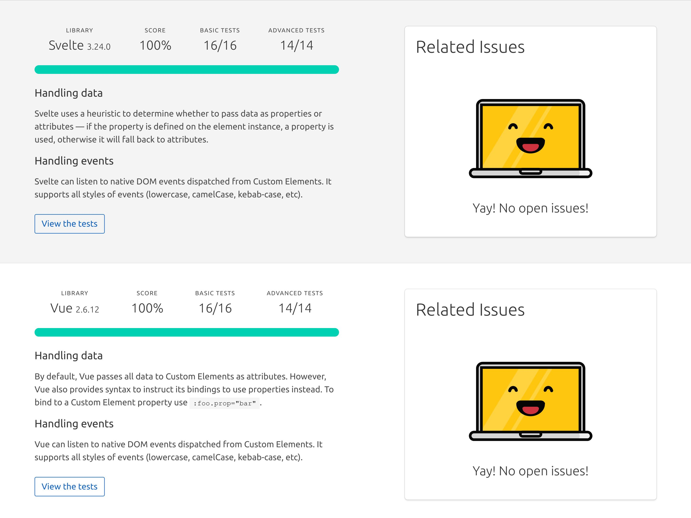
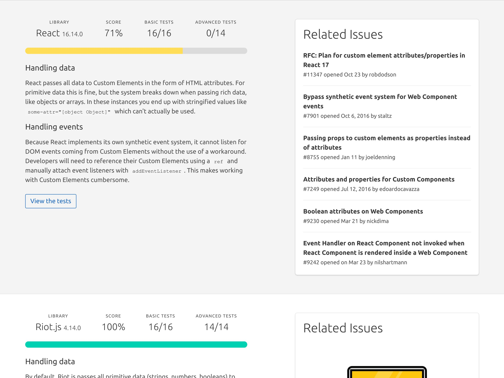

<script type="module" src="https://components.clever-cloud.com/load.js?version=7.1.0&lang=en&components=cc-input-text"></script>

# _Dans cette_ *Jungle de  l'outillage JavaScript*, _un retour à la simplicité est-il encore possible ?_

## poster fade-from
> @00:00:00@
> Slide poster pour commencer

## blank black fade-to
> #Fondu au noir#
> #Voix grave et lente#
> Détendez vous...
> Fermez les yeux...
> #Voix narrative (Fabrice Drouelle)#
> Vous êtes en juin 2008...
> Nadal vient de remporter son 4ème Roland Garros face à Roger Federer et on va pas s'mentir, le match était vraiment chiant.
> Vous hésitez à vous faire un ciné mais vous ne croyez *pas* à cette rumeur d'un 4ème Indiana Jones.
> À la place, vous décidez de regarder le season finale de Lost saison 4.

## blank black
> #Chuchoter#
> OMG, il y a machin dans un cercueil !!

## blank black 
> #Voix narrative (Fabrice Drouelle)#
> Du coup : impossible de dormir.
> Vous pensez à votre semaine de boulot qui reprend demain.
> Vous aimez votre poste de dev frontend.
<!-- > Vous aimez votre poste de dev frontend mais, -->
<!-- > #Voix grave, lente et rassurante# -->
<!-- https://www.w3counter.com/globalstats.php?year=2008&month=6 -->
<!-- > vous pestez souvent contre IE 6 et 7, et leurs 63% de part de marché. -->
<!-- > Le plus souvent, vous bosser avec Firefox et son légendaire add-on : Firebug. -->
<!-- > Ils ont quand même réussi à monter à 30 pourcents chez Mozilla. -->
<!-- > Pendant ce temps là, Safari et Opera se partage les miettes avec quelques pourcents chacun. -->
<!-- Dojo 2005, Prototype 2005, Mootools 2007 -->
<!-- https://jquery.org/history/ -->
<!-- > On en est à la version 1.2.6 (mai 2008). -->
<!-- > Côté framework JavaScript, vous avez testé Mootools et Prototype mais depuis quelques temps, vous êtes plutôt team jQuery. -->
> Vous avez essayé plusieurs frameworks JavaScript mais vous êtes plutôt team jQuery.
> Grâce à lui, les bugs d'IE ne vous font presque plus peur.

## blank black
> Vous avez besoin d'un plugin ? trop facile...
> une petite recherche et hop :
> => vous tombez sur Google Code,
> => vous copiez/collez la version minifiée dans votre projet,
> => vous ajoutez la balise script qui va bien,
> => et le tour est joué.
> Les jours de flemme vous référencez directement l'URL du CDN et ça "juste marche".
> Pas besoin de téléchargement local.

## blank black
> #Voix apaisée et lente#
> C'est beau.
> Cette simplicité vous appaise et vous vous endormez paisiblement.

## blank black
> #PAUSE#
> Soudain, vous vous reveillez en sursaut !!
> #Voix énergique et craintive#
> Que se passe t-il ?
> Mais où êtes vous ?
> Et surtout, quand êtes vous ?

## media contain
<!-- music predator ?? https://www.youtube.com/watch?v=oXnAxydhZ8M -->
<audio src="src/music/horn.ogg">

> #Voix grave et diabolique#
> Vous venez de débarquer en 2021 où le chaos s'est installé :

## media

> #Voix rapide#
> Nadal a perdu 4 fois Roland Garros.

## media

> La fin de Lost était nulle.

## media

> Il y a des rumeurs d'un 5ème Indiana Jones pour 2022
> #Voix Costello Lopez#
> n'im-por-te quoi là.
> #Voix rapide#
> Et pour coroner le tout, depuis qu'un mec a...

<!-- ## todo
brexit
> Le Royaume Uni est sorti de l'UE. -->

<!-- ## todo
comparatif fusées
> On continue à dérégler le climat mais pendant ce temps là, on a des milliardaires qui font un concours de "fusée". -->

## media

> ...bouffé un pangolin à l'autre bout de la planète,

## media

> on a tous la 5G et on voit...

## media

> ...des QR code partout.
> #Pause#
> Ouais je sais, c'est dingue mais vous pouvez me croire, j'ai fait mes propres recherches.
> #Clin d'oeil#
> Côté dev frontend, le monde est devenu fou :

<!-- ## todo
Chrome 63%
> Google a sorti un navigateur et domine le marché avec 63%. -->

<!-- ## todo
Microsoft Edge
> Microsoft a abandonné IE pour créer Edge, un navigateur basé sur celui de Google. -->

<!-- ## todo
iPhone = SMIC => Safari 18%
> Apple impose le moteur de Safari sur tous ses iMachins, du coup, ils sont montés à 18% (ah oui, l'iPhone coûte un SMIC maintenant). -->

<!-- ## todo
Firefox 5%
> En pendant ce temps là, notre petit panda roux adoré est tombé sous la barre des 5%.
> C'est tellement triste, mais attends il y a pire : -->

## media white

> #Voix sidérée#
> jQuery c'est devenu has been, genre has been de ouf.
> Maintenant, le framework à la mode,

## media

> c'est React et tout le monde fait des Single Page Application.
> Du coup, fini la simplicité de l'ère jQuery.
> Noooooonnnn... maintenant, pour ajouter une dépendance et l'utiliser...

## image-grid


> ...il te faut Node.js, npm, un task runner, un bundler, un transpiler, un minifier...
<!-- , un linter, un formatter... -->
> En vrai, faut un bac+17 pour s'y r'trouver dans tous ces outils JavaScript.
> #Ralentir#
> C'est devenu la jungle et j'crois vraiment qu'le moment est venu de faire le point sur la question.

## poster
> @00:02:30@
> #Voix normale et heureuse#
> Bonjour à *toutes* et à tous !
> J'm'appelle Hubert Sablonnière,
> J'suis développeur Web chez *Clever Cloud* et aujourd'hui, j'ai envie de vous parler de jungle et d'outils JavaScript.
> #Pause#
> On va d'abord revenir sur certains concepts et termes inventés _ou_ popularisés par ces outils.
> D'ailleurs, on va se concentrer sur l'ajout de dépendances et le build, sinon on en a pour la s'maine.
> Ensuite, on verra au travers d'un retour d'expérience, si c'est possible de revenir à un système plus simple...
> comment... ?
> et qu'est ce que ça implique ?
> #Pause#
> Allez, c'est parti, on commence tout de suite par un...

<!--
Cette section sert à expliquer des termes.
Il s'agit de techniques et fonctionnalités proposées par les outils de build/bundler/transpiler...
L'idée est de (ré)expliquer leur fonctionnement et leur but/utilité finale.
En soit, c'est une information intéressante.
De plus, ça resservira dans la deuxième partie.
-->
## section
Guide de survie
> ...petit guide de termes à connaitre pour survivre en milieu outils JavaScript.
> Dans les années 2000, quand on voulait améliorer les performances d'une page Web qui charge du JS, on faisait appel à la...

<!-- Pour chaque terme, on va le mettre en contexte et énoncer ce qui a amené le besoin d'une telle fonctionnalité -->
<!-- terme animé -->
<!-- terme + schema (progressif) : L'IDÉE => on explique ce que ça fait -->
<!-- terme + impact en text : LE BUT => on explique à quoi ça sert -->
<!-- terme + logos : on explique qui a amené le concept et quand -->

## definition animation
Minification
> ...minification.

## definition todo
Minification
<!-- TODO en étapes et en mettant en évidence des lignes bleues, des commentaires en gris et des espaces en blank -->

> *L'IDÉE :* on prend un fichier JS,
> on enlève les espaces, les commentaires... bref,
> tout ce qu'on peut pour que ça continue à fonctionner pareil,
> mais avec moins de code.
> #Pause#
> C'est une sorte de compression avec perte de données.

## definition logo
Minification


## definition
Minification
* Moins de code
* _(charger + parser + exécuter)_
> *LE BUT :* reduire la quantité de code que le navigateur va : charger, parser et exécuter.
> #Pause#
> C'est pas nouveau du tout hein.

<!-- https://www.fusioncharts.com/blog/5-excellent-javascript-minification-tools-to-improve-your-code-performance/ -->
## definition
Minification (regex)
* 2001: JSMin 
* 2004: Packer 
> Les moins jeunes se souviendront des précurseurs basés sur des regexs.
> C'est à partir de 2007, qu'on a vu apparaître...

## definition
Minification (parseur)
* 2007: ShrinkSafe 
* 2007: YUI<br>compressor 
* 2009: Closure<br>compiler 
* 2011: Uglify 
> ...des outils plus avancés qui parse le code pour le minifier.
> Avant l'arrivée de Node.js en 2009, ces outils étaient souvent codés en Java et utilisaient Rhino comme parseur.
> C'est eux qui on amené...

## definition
Minification
* _"mangling"_ de noms de variable
* &nbsp;
> ...le mangling de noms variables,
> ou encore de...

## definition
Minification
* _"mangling"_ de noms de variable
* élimination de code mort
 <!-- (DCE) -->
> ...l'élimination de code mort.
> Aujourd'hui, les outils modernes...

## definition
Minification
* 2018: Terser (JS) 
* 2019: swc (Rust) 
* 2020: esbuild (go) 
> ...sont devenus hyper puissants et rapides, surtout les p'tits nouveaux codés en Rust et en go.
<!-- > D'ailleurs si on prend le jQuery de juin 2008 minifié avec Packer, il fait 54 kilo. -->
<!-- > alors que si on le passe dans terser, il fait 45 kilo. -->

<!-- ## todo
TERSER:
It's not well known, but whitespace removal and symbol mangling accounts for 95% of the size reduction in minified code for most JavaScript - not elaborate code transforms. One can simply disable compress to speed up Terser builds by 3 to 4 times. -->

<!-- curl -s https://code.jquery.com/jquery-1.2.6.min.js | human-size -->
<!-- curl -s https://code.jquery.com/jquery-1.2.6.min.js | terser --compress --mangle | human-size -->
<!-- curl -s https://code.jquery.com/jquery-3.6.0.min.js | human-size -->
<!-- curl -s https://code.jquery.com/jquery-3.6.0.min.js | terser --compress --mangle | human-size -->

<!-- ## code todo
```js
const FORD_NAME = 'Harrison';
const FORD_YEAR = 1942;

function playIndianaJones (currentYear, name, year) {
    const age = currentYear - year;
    if (age > 50) {
        console.log('NOOOO, ' + name + ' is too old!');
    }
    else {
        console.log('NOOOO, the trilogy is enough.');
    }
}

playIndianaJones(2021, FORD_NAME, FORD_YEAR);
``` -->

<!-- 
{
  module: true,
  compress: {
    passes: 2,
  },
}
-->

<!-- ## code todo
```js
console.log("NOOOO, Harrison Ford is too old!");
``` -->

## blank white
> Pour des raisons de confort de dev, on a commencé à séparer nos fichiers.
> Tant qu'on les chargeait dans le bon ordre,
> en gros tant qu'on mettait jQuery d'abord et les plugins jQuery ensuite etc...
> ça se passait bien.
> Du coup, pour pas déteriorer les perfs et l'expérience utilisateur, on a commencé à faire de la...

## definition animation
Concaténation
> ...Concaténation.

## definition todo
Concaténation
<!-- TODO en étapes et en mettant en évidence des lignes dans les fichiers -->

> *L'IDÉE :* on prend plusieurs fichiers et on les assemble en un seul fichier en respectant l'ordre.

## definition logo
Concaténation


## definition
Concaténation
* Moins de requêtes HTTP
> *LE BUT :* reduire le nombre de requêtes HTTP.
> Avec HTTP 1.1, un navigateur ne peut pas faire + de 6 requêtes en parallèle vers le même site.
> Pour automatiser ça, on a commencé à dégainer des...

## definition
Task runners / Pipeline
* 2011/2012: Brunch 
* 2012: Grunt 
* 2013: Gulp 
* 2014: Broccoli 
> ...task runners et autres outils orientés pipeline.
> J'ai envie de dire, c'était le bon vieux temps, mais je bosse encore sur une app qui utilise grunt donc bon.

## blank white
> Respecter l'odre des fichiers, c'était un peu fragile du coup,
> on a commencé utiliser des systèmes de modules pour expliciter les dépendances.
<!-- > Le module A a besoin de module B qui lui a besoin de module C. -->
> C'est là qu'on est passé au niveau supérieur de la concaténation...

## definition animation
Bundling
> ...le bundling.

## definition todo
Bundling
<!-- TODO en étapes et en mettant en évidence des lignes dans les fichiers et les imports, ajouter de la glue en jaune -->

> *L'IDÉE :* on prend un fichier source, on analyse les dépendances et on les assemble dans le bon ordre, dans un seul fichier et avec un peu de glue pour que ça continue à fonctionner.
> C'est une sorte de concaténation ++ qui connait le système de modules et qui se base sur le graphe de dépendances.

## definition logo
Concaténation


## definition
Bundling
* Moins de requêtes HTTP
> *LE BUT :* toujours réduire le nombre de requêtes HTTP.
> Le graphe de dépendances se limite pas à JavaScript, certains outils sont capables d'analyser les dépendances entres des fichiers HTML, des CSS, des images, des polices, etc.
<!-- logo cjs/esm https://github.com/wessberg/cjstoesm -->

<!-- https://github.com/google/closure-compiler/blob/7ff6e25843097791416d1544c88dc8711f6be64a/src/com/google/javascript/jscomp/deps/DepsGenerator.java -->
## definition
Bundling (précurseurs)
* 2009: Closure<br>compiler 
* 2010: Builder<br>(Dojo Toolkit) 
* 2010: r.js<br>(requirejs) 
* 2011: Browserify 
> Au début on faisait du bundling avec des systèmes de modules customs,
> puis on est passé sur AMD,
> et ensuite une bonne partie de la communauté a opté pour le système CommonJS (polularisé par Node.js).
> C'est avec l'arrivée de...

<!-- https://github.com/google/closure-compiler/blob/7ff6e25843097791416d1544c88dc8711f6be64a/src/com/google/javascript/jscomp/deps/DepsGenerator.java -->
## definition
Bundling
* 2014: Webpack 
* 2015: Rollup 
* 2018: Parcel 
> ...Webpack et ses amis qu'on a commencé à avoir du support pour les modules ECMAScript.
> Webpack est clairement le plus utilisé mais réputé pour être le plus relou à configurer,
> Rollup est le seul qui sait exporter du format ESM, ECMAScript module,
> et Parcel se vante d'être zéro config.

<!-- peut-être à la fin -->
## media todo
https://bundlers.tooling.report/

> Si vous voulez en savoir plus sur ces outils, les équipes devrel de Google on fait un site comparatif avec des tableaux de qui sait faire quoi.

> Comme pour la minification...

## definition
Bundling (nouvelle génération)
* 2020: esbuild (go) 
* 2020: Spack (Rust) 
* 2020/2021: Rome (JS/rust) 
> ...on retrouve les petits nouveaux codés en go ou en Rust et qui envoient du lourd au niveau perfs.

## media top

> Quand je dis lourd, c'est du très lourd.
> C'est un benchmark hein, mais esbuild est 100 fois plus rapide pour minifier et bundler.
<!-- > C'est tellement performant qu'on a vu arriver l'année dernière... -->

<!-- TODO cette partie, ça va pas -->
<!-- ## definition todo
Serveurs de dev
* 2020: WDS 
* 01/2020: Snowpack 
* 04/2020: Vite 
> Des outils qui utilisent esbuild sous le capot pour proposer une expérience de dev ultra performante,
> et Rollup pour le build de prod un peu plus complexe. -->

## blank white
> Au fur et à mesure bla bla on a vu apparaitre différentes techniques dans le bundling.

## definition animation
Scope hoisting
> *L'IDÉE :* simplifier la glue et l'isolation qui est nécessaire autour de chaque module dans le bundle final.

## definition
Scope hoisting
```js
// lib.js
export function add (a, b) {
  return a + b;
}
```
```js invisible
// index.js
import { add } from './lib.js';
console.log(add(1, 2));
console.log(add(2, 3));
```

## definition
Scope hoisting
```js
// lib.js
export function add (a, b) {
  return a + b;
}
```
```js
// index.js
import { add } from './lib.js';
console.log(add(1, 2));
console.log(add(2, 3));
```

## definition
Scope hoisting
```js small
// bundle.js - Webpack 4 SANS import hoisting
!function(e){var t={};function n(r){if(t[r])return t[r].exports;var o=t[r]={i:r,l:!1,exports:{}};return e[r].call(o.exports,o,o.exports,n),o.l=!0,o.exports}n.m=e,n.c=t,n.d=function(e,t,r){n.o(e,t)||Object.defineProperty(e,t,{enumerable:!0,get:r})},n.r=function(e){"undefined"!=typeof Symbol&&Symbol.toStringTag&&Object.defineProperty(e,Symbol.toStringTag,{value:"Module"}),Object.defineProperty(e,"__esModule",{value:!0})},n.t=function(e,t){if(1&t&&(e=n(e)),8&t)return e;if(4&t&&"object"==typeof e&&e&&e.__esModule)return e;var r=Object.create(null);if(n.r(r),Object.defineProperty(r,"default",{enumerable:!0,value:e}),2&t&&"string"!=typeof e)for(var o in e)n.d(r,o,function(t){return e[t]}.bind(null,o));return r},n.n=function(e){var t=e&&e.__esModule?function(){return e.default}:function(){return e};return n.d(t,"a",t),t},n.o=function(e,t){return Object.prototype.hasOwnProperty.call(e,t)},n.p="",n(n.s=1)}([
  // lib.js
  function(e,t,n){"use strict";function r(e,t){return e+t}n.d(t,"a",(function(){return r}))},
  // index.js
  function(e,t,n){"use strict";n.r(t);var r=n(0);console.log(Object(r.a)(1,2)),console.log(Object(r.a)(2,3))}
]);
```

## definition
Scope hoisting
```js small
// bundle.js - Webpack 4 AVEC import hoisting
!function(e){var t={};function n(r){if(t[r])return t[r].exports;var o=t[r]={i:r,l:!1,exports:{}};return e[r].call(o.exports,o,o.exports,n),o.l=!0,o.exports}n.m=e,n.c=t,n.d=function(e,t,r){n.o(e,t)||Object.defineProperty(e,t,{enumerable:!0,get:r})},n.r=function(e){"undefined"!=typeof Symbol&&Symbol.toStringTag&&Object.defineProperty(e,Symbol.toStringTag,{value:"Module"}),Object.defineProperty(e,"__esModule",{value:!0})},n.t=function(e,t){if(1&t&&(e=n(e)),8&t)return e;if(4&t&&"object"==typeof e&&e&&e.__esModule)return e;var r=Object.create(null);if(n.r(r),Object.defineProperty(r,"default",{enumerable:!0,value:e}),2&t&&"string"!=typeof e)for(var o in e)n.d(r,o,function(t){return e[t]}.bind(null,o));return r},n.n=function(e){var t=e&&e.__esModule?function(){return e.default}:function(){return e};return n.d(t,"a",t),t},n.o=function(e,t){return Object.prototype.hasOwnProperty.call(e,t)},n.p="",n(n.s=0)}([
  
  
  // index.js + lib.js
  function(e,t,n){"use strict";function r(e,t){return e+t}n.r(t),console.log(r(1,2)),console.log(r(2,3))}
]);
```

## definition
Scope hoisting
```js
// bundle.js - Rollup
(function () {
  'use strict';
  function add (a, b) {
    return a + b;
  }
  console.log(add(1, 2));
  console.log(add(2, 3));
})();
```

## definition
Scope hoisting
* Moins de code
* _(charger + parser + exécuter)_
> *LE BUT :* reduire à quantité de code que le navigateur doit : charger, parser et exécuter.

## definition logo
Scope hoisting


## definition animation
Tree shaking
<!-- il faut une vidéo de moi qui secoue un arbre -->

## definition
Tree shaking

> ...le tree shaking
> C'est une technique qu'on applique au moment du bundling.
> *L'IDÉE :* on prend un fichier source, on analyse ses dépendances et surtout on analyse précisémment ce qu'il importe des dépendances qu'il utilise pour ne garder que ces parties dans le bundle final.

## definition
Tree shaking
* Moins de code
* _(charger + parser + exécuter)_
> *LE BUT :* reduire à quantité de code que le navigateur doit : charger, parser et exécuter.

## definition logo
Tree shaking


## blank white
> La transition peut se faire sur le fait qu'on a fait des méga fat bundle avec ça

## definition animation
Code splitting

<!-- TODO: refaire le schema avec les imports dynamiques -->
## definition todo
Code splitting

> *L'IDÉE :* ne plus produire un seule gros bundle avec tout le code et se servir des imports dynamiques pour faire plusieurs plus petits fichiers.
> On va souvent retrouver cet usage dans la définition des routes d'une app.
> slash home importe dynamiquement home.js,
> slash contact importe dynamiquement contact.js
> et ainsi de suite.

## definition
Code splitting
> *LE BUT :* reduire à quantité de code que le navigateur doit : charger, parser et exécuter pour afficher une page.
> *LE BUT :* se reposer sur le cache pour les morceaux qu'il a déjà.
* Moins de code au premier chargement
* Meilleure utilisation du cache

## definition logo
Tree shaking


## definition logo
Tree shaking


## definition animation
Import hoisting

## definition
Import hoisting
```js
// one.js
export function one () { return 1; }
```
```js
// two.js
import { one } from './one.js';
export function two () { return one() + 2; }
```
```js
// index.js
import { two } from './two.js';
console.log(two());
```

## definition
Import hoisting
* Réduire effet escalier

## definition logo
Import hoisting


## definition animation
Content hashing

## definition
Content hashing

> ...le Content hashing.
> *L'IDÉE :* on prend le contenu de chaque fichier, on calcule un hash et on l'ajoute dans le nom du fichier.
> On a aussi appelé ça du revving à l'époque de grunt/gulp.

## definition
Content hashing
* Meilleure utilisation du cache
* &nbsp;

## definition
Content hashing
* Meilleure utilisation du cache
* _(navigateur, proxy, CDN...)_
> *LE BUT :* Pousser les caches à considérer les fichiers comme immutables
> Si un navigateur ou un proxy cache voit passer un fichier, il peut théoriquement que tel nom correspondra toujours à tel contenu.
> Ici on vient améliorer l'expérience des visites répétées.

## definition logo
Import hoisting


<!-- confort du dev -->
## definition animation
Transpiling

## definition
Transpiling
* Langage (JSX, TS...)
* &nbsp;

## definition
Transpiling
* Langage (JSX, TS...)
* Syntaxes/fonctionnalités JS _"moderne"_

## definition
Transpiling
* Facilite la vie des devs

## definition
Transpiling
* 2009: CoffeeScript 
* 2014: Traceur 
* 2014: TypeScript 
* 2014: Babel<br>(6-to-5) 

## definition
Transpiling (nouvelle génération)
* 2020: esbuild (go) 
* 2020: SWC (rust) 
* 2020/2021: Rome (JS/rust) 

## blank white
> Tout ces outils qui font du bundling sont capable de faire...

## definition animation
Module resolution
> ...de la résolution de module.
> Directement ou via un plugin.

## definition
Module resolution
```js
// bare import specifier :
import { createStore } from 'redux';
```
```js invisible
// import relatif :
import { createStore } from '../node_modules/redux/lib/redux.js';
```
> *L'IDÉE :* transformer ce qu'on appelle un `bare import specifier`, un import tout nu avec juste le nom npm,

## definition
Module resolution
```js
// bare import specifier :
import { createStore } from 'redux';
```
```js
// import relatif :
import { createStore } from '../node_modules/redux/lib/redux.js';
```
> en un chemin relatif qui pointe vers un vrai fichier.
> *LE BUT :* référencer directement une dépendance sans se soucier de savoir où la trouver.
> Le plus compliqué que ça en a l'air.
> Un navigateur sait faire une requête vers une URL absolue ou relative mais pas vers un simple nom de packet npm.

<!-- recap -->
## todo fade-from
* Pour l'utilisateur
  * moins de code
    * minification
    * scope hoisting
    * tree shaking
    * code splitting
  * moins de requêtes
    * concatenation
    * bundling
  * meilleur cache
    * content hashing
    * code splitting
  * moins d'escalier
    * import hoisting
* Pour le développeur
  * transpiling

<!-- 
Côté serveur
* Pour l'utilisateur
  * moins de requêtes
  * moins de code
    * compression
  * meilleur cache
    * header de cache
  * moins d'escalier
    * domain sharding
    * HTTP/2 pipelining
    * preload
    * HTTP/2 push
 -->

<!--
Cette section sert à...
* la comlexité des outils (JavaScript) existe
  * trop de choix
  * difficile à brancher entre eux
  * ça rend le dev frontend moins accesibles au nouveaux
* ces outils sont arrivées via le monde des fwk JS et SPA (le full front)
  * cela force les autres dev frontend à adopter Node.js + npm ...
* pour autant les fonctionnalités apportés par ces outils ont une utilité
> * Est-ce que c'était mieux avant ? : digression sur l'utilité et l'impact de ces évolutions
> ** On constate les avantages et inconvénients
> * ?? (1) comment réduire la dépendance à nos outils ?
> ** Apporter un début de piste
> * ?? (2) comment rendre tout ceci plus accessible ?
> ** Différents cas de figures auxquels on pourrait s'intéresser pour simplifier l'expérience de dev mais ici on va se pencher sur :
> * analogie des pizzas
-->

## blank black fade-to
> #Pause#
> #Gestes des mains de la tête qui explose#
> J'sais pas vous mais quand j'vois tous ces outils et ces termes, j'ai une p'tite voix d'boomer dans ma tête qui fait :
> #Voix de p'tit vieux#
> Oh bah franchement...

## section
C'était mieux avant
> ...c'était mieux avant.
> #Malaise, voix gênée#
> Euuuuuuh......
> Faut fait attention à la nostalgie, c'est comme l'alcool, ça peut faire dire pas mal de bêtises quand même.
> Du coup, on va tenter de rester sérieux et on va se...

## text
🤔
> ...poser objectivement la question.
> #Pause#
> D'un côté, quand j'vois cette complexité...

## text
👍
<!-- 👍 Oui -->
> ...j'ai envie de répondre oui.
> On ne compte plus les...

## media

> ...articles qui parlent de JavaScript fatigue et qui décrivent souvent la même réalité.
> Il y a beaucoup d'outils et certains font plus ou moins la même chose, du coup...

## text
😕 Choix difficiles
> ...les choix sont difficiles.
> Niveau compatibilité, c'est pas évident de les brancher entre eux, du coup...

## text
🤬 MàJ compliquées
> ...les mises à jour sont compliquées.
> Heureusement,

## definition
* : Angular 
* : Ember 
* : React 
* : Svelte 
* : Vue 
> les frameworks JS proposent leur propre ligne de commande ou des générateurs de projets pre-configurés.
> C'est bien hein.
> C'est d'ailleurs pour ça qu'on choisit un framework, pour qu'il fasse des choix à notre place et...

<!-- ## definition
* : Rome 

## media
 -->

## text
⏱️ Gagner du temps
> ...gagner du temps.
> Par contre, comme avec n'importe quelle couche d'abstraction, on accepte...

## text
🔐 Abandonner le contrôle
> ...d'abandonner le contrôle de la chaîne de build.
> Ça implique...

## text
🔒 Couplage code/outils fort
> un couplage fort entre notre code et les outils.
> À tel point qu'aujourd'hui, plusieurs de ces frameworks ne peuvent pas être utilisés sans la suite d'outils qui va avec.
<!-- Le premier qui me dit, bah si tu peux faire du React sans JSX -->
<!-- > D'ailleurs, si on regarde les dépendances proposées par les communautés respectives de ces frameworks (plugins, composants...), -->
<!-- > la quasi totalité des projets ne proposent qu'une seule méthode d'installation : `npm install` + bundler. -->
<!-- détailler la méthode d'installation -->

## blank white
> Au fur et à mesure des années, je me suis habitué aux règles de cette bulle JavaScript.
> Du coup, quand on a commencé nôtre bibliothèque de composants chez Clever,
> j'étais un peu du genre :
> "Tu veux utiliser nos composants ?"

## definition
* : Node.js 
* : npm 
* : Webpack 
> C'est sur npm, débrouille toi avec ton bundler.

## blank white
> La détail important, c'est qu'on a fait le choix d'exposer des Web Components.
> Un standard du Web qui permet de dire :

## code
```js
class MyComponent extends HTMLElement {
  // ...
}
```
```js invisible
customElements.define('my-component', MyComponent);
```
```html invisible
<my-component></my-component>
```
> je définis le comportement de mon composant dans une classe,

## code
```js dim
class MyComponent extends HTMLElement {
  // ...
}
```
```js
customElements.define('my-component', MyComponent);
```
```html invisible
<my-component></my-component>
```
> J'associe cette classe à une balise HTML spécifique,

## code
```js dim
class MyComponent extends HTMLElement {
  // ...
}
```
```js dim
customElements.define('my-component', MyComponent);
```
```html
<my-component foo="something">Hello</my-component>
```
> et du coup, mes utilisateurs peuvent l'utiliser comme n'importe quelle autre balise.

<!-- ## definition
* 2016: Chrome 
* 2017: Safari 
* 2018: Firefox  -->
> Ça marche dans tous les navigateurs modernes,
<!-- https://caniuse.com/template -->

<!-- ## definition
* : Angular 
* : Ember 
* : React 
* : Svelte 
* : Vue  -->
> avec tous les frameworks,

<!-- ## media


## media


## media


## media
 -->
> (sauf avec React où il faut ajouter de la glue).

> Ça marche aussi avec des sites statiques écrit en Markdown,
> des sites multi pages codés en Java/PHP/Ruby qui font du templating côté serveur.
<!-- ça marche même dans des slides HTML -->

## text
😍 Web Components partout !
> Bref, ça marche partout quoi.
<!-- > Il n'y a pas que le JavaScript dans la vie. (je répète) -->
> Du coup, c'est un peu culotté d'imposer cette...

<!-- ## definition
* : Node.js 
* : npm 
* : Webpack  -->
> ...taxe "Node.js + npm + bundler" à des professionnels du Web dont le socle ne tourne pas autour de JavaScript.

## code
```html
<script src="https://code.jquery.com/jquery-1.2.6.min.js"></script>
```
> Donc oui, d'une certaines manière, c'était mieux avant quand on mettais juste une balise vers le CDN de jQuery.
<!-- > C'est d'ailleurs ce que font la majorité des bilbiothèques : moment, charts.js,  -->

## text
👎
<!-- 👎 Non -->
> De l'autre côté ... quand je regarde les gains de perf qu'apportent tous ces outils, j'ai envie de répondre non, c'était *pas* mieux avant.
<!-- jquery terser -->
> Ma bibliothèque de composants, c'est pas juste une seule fichier.
> Si une personne veut utiliser uniquement le composant `<cc-input-text>`, en français,
> son bundler va appliquer toutes les techniques qu'on a évoqué pour produire le plus petit morceau de code possible et assurer les meilleurs perfs pour l'utilisateur.
> En mode CDN, je fais quoi ?
> #Pause#
> Je vais être obligé de dire :
> "Tiens, voici un méga fichier avec tous les composants, toutes leurs dépendances et toutes les langues. Amuse toi bien !".
> Les perfs vont être nulles.
> En plus, quand cette personne passera sur une nouvelle version, il y aura des nouveaux composants, ça sera encore plus lourd.

## text no-emoji
Ça dépend <sup>™️</sup>
> En fait, elle est relou cette question.
> Nous ce qu'on veut savoir, c'est :
> est-ce que c'est possible de retrouver...

## text
🍕 Simplicité
> ...la simplicité du mode balise script vers un CDN,

## text
👨‍🍳 Performances
> mais avec les mêmes performances que si on avait utilisé un bundler et tous ces machins.
> C'est ce qu'on a essayé de faire chez Clever Cloud, petit retour d'expérience
<!-- > => DIY / PnP -->

## section
<!-- Un nouvel espoir... -->
<!-- Retour d'expérience -->
<!-- Vers la simplicité<br>et au delà ? -->
Retour à la simplicité...

## media logo


## todo
Les composants chez Clever Cloud

## demo-html
```html
<cc-input-text value="my s3cr3t" secret clipboard></cc-input-text>
```
<cc-input-text value="my s3cr3t" secret clipboard style="font-size: 2em; width: 14em"></cc-input-text>
> contexte Clever Cloud: web components, besoins internes divers, besoins externes

## media


## media


## todo
> Pour les utiliser dans la console, une SPA, il faut : (lister toutes les étapes avec node.js machin)
> parler aussi des étapes de mise en prod :
> compression, header de cache, h1/h2/h3...

## todo
> on veut utiliser nos composant ailleurs que dans des SPA
> MPA Play/Scala, Wordpress, site statique
> on veut que des clients ou des partenaires puisse les utiliser le plus facilement possible

## todo
DIY vs Plug-and-Play
> explication du DIY (je sais ce que je fais, je veux la maitrise)
> explication du Plug-and-play (je veux pas prendre cette complexité à ma charge, ça ne vaut pas le coup, donne moi le meilleur résultat possible)
> analogie pizza

## todo
> ici le DIY, c'est ce qu'on a déjà évoqué
> le plug-and-play, finalement, ça serait plutôt une approche à la jQuery avec juste des balises script

## todo
> précisons qu'il n'y a rien de bien nouveau
> on avait déjà des CDN publics avant
> ce qui a changé, c'est qu'aujourd'hui, certains d'entre eux sont un peu plus smart
> ils ont une connaissance de npm
> resolution des bare imports
> semver
> polyfill
> compression
> jspm, unpkg, skypack
> l'autre truc qui a changé, c'est qu'on ne peut plus se reposer sur le cache partagé d'un CDN

## media


## media


## media


## todo
> mais du coup, qu'est ce que ça implique dans notre cas particulier ce mode plug and play ?
> expliquer qu'on utilise ESM et on publie sur npm en ESM
> maintenant c'est supporté dans les browsers
> du coup, ça marche sans rien faire

<!-- https://modernizr.com/download?ambientlight-audio-batteryapi-setclasses -->

## definition
Exemple support
* 89: Chrome 
* 89: Firefox 
* 89: Safari 

## todo
> par contre, on doit quant même demander à nos utilisateurs de mettre une balise script par composant
> en plus c'est pas minifié à 100% (CSS, JS)
> ça ne gère pas tjs les images (SVG et sans oublier la minification)
> + le i18n avec le boilerplate de setup de langue (si c'est nécessaire)

## todo
> idée, est-ce qu'on ne pourrait pas faire notre propre smart CDN
> et avoir une seule balise script pour les gouverner tous

## todo
> allez, c'est parti
> on va commencer par le pire cas possible
> et on va mesurer

## todo
> Source individual ES modules (raw unminified)
> Minify JavaScript
> Minify inlined HTML templates and CSS
> Minify SVG
> Enable treeshaking
> Shim unused stuffs from 3rd parties
> Enable gzip
> Enable brotli
<!-- > Keep alive TODO?? -->
<!-- > domain sharding TODO?? -->
<!-- > Enable HTTP/2 TODO?? -->
<!-- > Enable HTTP/3 TODO?? -->
> Code splitting (chunks)
> Code splitting (manual chunks)
> Hoist imports (rollup system)
> Hoist imports (JS depcache reverse order)
> Hoist imports (JS depcache reverse order dynamic import)
> Hoist imports (JS depcache reverse order dynamic import + preload SVG)
<!-- > Preload with Link header TODO?? -->
<!-- > HTTP/2 push TODO?? -->
> comparer à tout dans le bundle
> comparer à un bundle sélectif

## todo
> la cerise sur le gateau
> c'est l'auto i18n au besoin
> la bonne gestion du cache entre versions
> (pourrait mieux faire avec les import maps)
 
## todo
> serveiller les import maps
> serveiller les web bundles / resource bundles https://github.com/WICG/resource-bundles

## todo
> expliquer la mise en place du Cellar + endpoint dynamique chez CF

## section
Et après ?
> en fait, de la même manière qu'avec notre plateforme Cloud, on essaye de convaincre les gens de pas se prendre la tête avec les serveurs, les mises à jour, la sécu tout ça et de nous le déléguer car on sait faire
> ici on vient déplacer la connaissance et la complexité de "prodification" de l'app qui consomme à celui qui expose un lib de composants
> comme vous l'avez vu, c'est pas forcément la meilleure solution, mais on trouve que dans pas mal de cas, le résultat est sufisant comparer à cout de mise en place et maintenance
> on espère que ça vous donnera des idées
> ouverture sur le déplacement de qui own le bundling ? (as a service)
> ouverture sur web bundles (new name)
> ouverture sur le bundling à la volée

## todo
conclusion
> Le monde du JavaScript est devenu un peu fou.
> Cette jungle d'outils est dense et seuls les plus "veille" peuvent s'y retrouver.
> Ça n'est pas une situation acceptable et il faut rester vigilants.
> Entre ceux qui disent que c'était mieux avant et les drogués aux derniers outils à la mode, il faut trouver un juste milieu.
> Il faut chercher le bon curseur pour atteindre des bonnes performances pour les utilisateurs tout en
> .à tel point qu'il devient utile de se poser pour faire le point sur ce vaste écosystème.
> Le Web est bien plus vaste que le petit monde des SPAs codées avec le dernier framework JS à la mode.
> Le Web c'est pour tout le monde et il n'y a pas de raisons que ça devienne un club réservé à une élite californienne.
> Il faut faire attention à ne pas trop se reposer sur nos séries d'outils et éviter les "oui mais ça tout le monde connait".

## poster
*Merci beaucoup !* _vous êtes un super public..._
> notes for empty slide (line 1)

## credits

Liens :

* Source des composants : https://github.com/CleverCloud/clever-components
* Storybook des composants : https://www.clever-cloud.com/doc/clever-components/
* UI pour sélectionner : https://components.clever-cloud.com/
* Smart CDN source : https://github.com/CleverCloud/clever-components-cdn

Images :

* Fond jungle : https://www.vexels.com/vectors/preview/70035/tropical-frame-styled-jungle-background
* Calendrier 2021 : https://unsplash.com/photos/F32jPy9SMaw
* 2021 masques : https://unsplash.com/photos/q5BnGgt2Y_E
* Fond fête : https://www.vecteezy.com/vector-art/237001-party-crowd
* Pangolin : https://unsplash.com/photos/mtTpAM2uaRM
* Antenne : https://unsplash.com/photos/31JqyCVndUM
* QR code : https://unsplash.com/photos/2HWkORIX3II

Polices :

* Tintin : https://www.cufonfonts.com/font/tintin
* PT Sans : https://fonts.google.com/specimen/PT+Sans
* Anton : https://fonts.google.com/specimen/Anton

Sons :

* Marimba note : https://www.youtube.com/watch?v=8FJMTJmuoU8
* Horn sound effect : https://www.youtube.com/watch?v=gKz1X2rn3CQ
* Forest sound : https://www.youtube.com/watch?v=IsPBplWLImI

Liens :

* https://fr.wikibooks.org/wiki/Code_de_la_route/Liste_des_panneaux