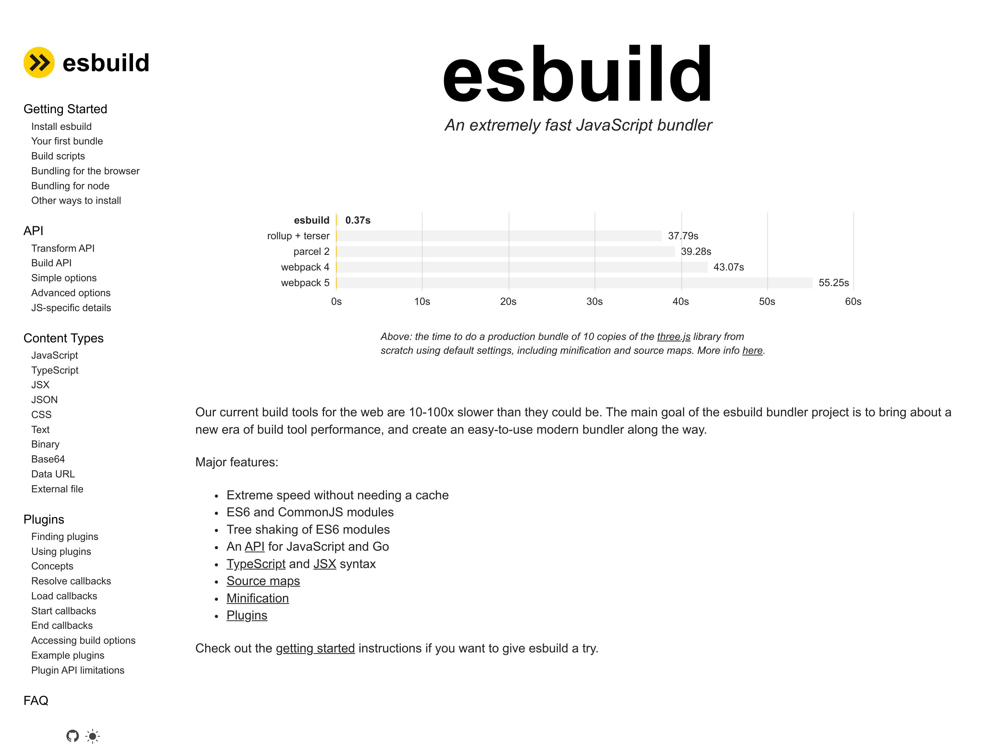
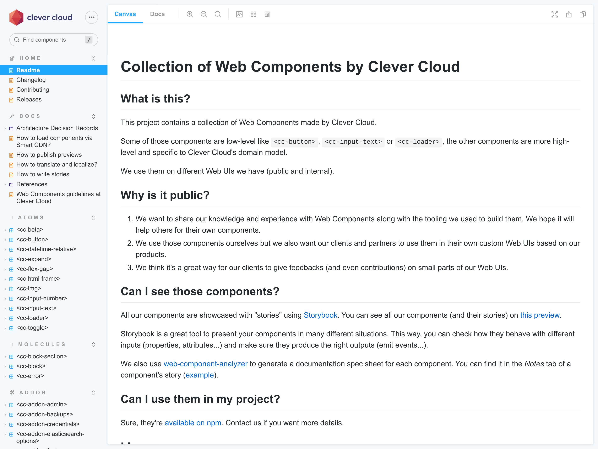

# _Dans cette_ *Jungle de  l'outillage JavaScript*, _un retour à la simplicité est-il encore possible ?_

## poster
> Slide poster pour commencer

## blank black
> #Fondu au noir#
> #Voix grave, lente (Fabrice Drouelle)#
> Détendez vous...
> Fermez les yeux...
> Vous êtes en juin 2008...
> Nadal vient de remporter son 4ème Roland Garros face à Roger Federer et on va pas s'mentir, le match était vraiment chiant.
> Vous hésitez à vous faire un ciné mais vous ne croyez *pas* à cette rumeur d'un 4ème Indiana Jones.
> À la place, vous décidez de regarder le season finale de Lost saison 4.
> #Voix enthousiaste#
> Putain, il y a machin dans un cercueil !!
> #Voix grave, lente (Fabrice Drouelle)#
> Du coup : impossible de dormir.
> Vous pensez à votre semaine de boulot qui reprend demain.
> Vous aimez votre poste de dev frontend.
<!-- > Vous aimez votre poste de dev frontend mais, -->
<!-- > #Voix grave, lente et rassurante# -->
<!-- https://www.w3counter.com/globalstats.php?year=2008&month=6 -->
<!-- > vous pestez souvent contre IE 6 et 7, et leurs 63% de part de marché. -->
<!-- > Le plus souvent, vous bosser avec Firefox et son légendaire add-on : Firebug. -->
<!-- > Ils ont quand même réussi à monter à 30 pourcents chez Mozilla. -->
<!-- > Pendant ce temps là, Safari et Opera se partage les miettes avec quelques pourcents chacun. -->
<!-- Dojo 2005, Prototype 2005, Mootools 2007 -->
<!-- https://jquery.org/history/ -->
<!-- > On en est à la version 1.2.6 (mai 2008). -->
<!-- > Côté framework JavaScript, vous avez testé Mootools et Prototype mais depuis quelques temps, vous êtes plutôt team jQuery. -->
> Vous avez essayé plusieurs frameworks JavaScript mais vous êtes plutôt team jQuery.
> Grâce à lui, les bugs d'IE ne vous font presque plus peur.
> Vous avez besoin d'un plugin ? trop facile...
> une petite recherche et hop :
> => vous tombez sur Google Code,
> => vous copiez/collez la version minifiée dans votre projet,
> => vous ajoutez la balise script qui va bien,
> => et le tour est joué.
> Les jours de flemme vous référencez directement l'URL du CDN et ça "juste marche".
> Pas besoin de téléchargement local.
> #Voix admirative#
> C'est beau.
> Cette simplicité vous appaise et vous vous endormez paisiblement.
> #pause#
> Et soudain, PAF, vous ouvrez les yeux !!
> #Voix énergique et craintive#
> Que se passe t-il ?
> Mais où êtes vous ?
> Et surtout, quand êtes vous ?

## media contain
<!-- music predator ?? https://www.youtube.com/watch?v=oXnAxydhZ8M -->
<audio src="src/music/horn.ogg">

> #voix grave#
> Vous venez de débarquer en 2021 où le chaos s'est installé :

## media

> #Rapide#
> => Nadal a perdu 4 fois Roland Garros.

## media

> => La fin de Lost était nulle.

## media

> => Il y a des rumeurs d'un 5ème Indiana Jones pour 2022 ... n'im-por-te quoi.

<!-- ## todo
brexit
> => Le Royaume Uni est sorti de l'UE. -->

<!-- ## todo
comparatif fusées
> => On continue à dérégler le climat mais pendant ce temps là, on a des milliardaires qui font un concours de "fusée". -->

## media

> => Et pour coroner le tout, depuis qu'un mec a bouffé un pangolin à l'autre bout de la planète,

## media


## media

> on s'est tous fait injecter la 5G et on voit des QR code partout.
> #Pause#
> Ouais je sais, c'est dingue mais vous pouvez me croire, j'ai fais mes propres recherches.
> #Clin d'oeil#
> Côté dev frontend, le monde est devenu fou :

<!-- ## todo
Chrome 63%
> Google a sorti un navigateur et domine le marché avec 63%. -->

<!-- ## todo
Microsoft Edge
> Microsoft a abandonné IE pour créer Edge, un navigateur basé sur celui de Google. -->

<!-- ## todo
iPhone = SMIC => Safari 18%
> Apple impose le moteur de Safari sur tous ses iMachins, du coup, ils sont montés à 18% (ah oui, l'iPhone coûte un SMIC maintenant). -->

<!-- ## todo
Firefox 5%
> En pendant ce temps là, notre petit panda roux adoré est tombé sous la barre des 5%.
> C'est tellement triste, mais attends il y a pire : -->

## media white

> #Voix sidérée#
> jQuery c'est devenu has been, genre has been de ouf.
> Maintenant, le framework à la mode,

## media

> c'est React et tout le monde fait des Single Page Application.
> Du coup, tu peux oublier la simplicité plug-and-play de l'ère jQuery.

## image-grid


> Non... maintenant, pour ajouter une dépendance et l'utiliser, il te faut Node.js, npm, un task runner, un bundler, un transpiler, un minifier, un linter, un formatter...
> En vrai, faut un bac+17 pour t'y retrouver dans tous ces outils JavaScript.
> #Ralentir#
> C'est devenu la jungle et j'crois vraiment qu'le moment est venu de faire le point sur la question.

## poster
> #mode normal (et énergique)#
> Bonjour à *toutes* et à tous !
> J'm'appelle Hubert Sablonnière,
> J'suis développeur Web chez #Clever Cloud# et aujourd'hui, j'ai envie de vous parler de jungle et d'outils JavaScript.
> On va d'abord revenir sur certains concepts et termes inventés ou popularisés par ces outils.
> D'ailleurs, on va se concentrer sur le build JavaScript, sinon on en a pour la semaine.
> Et ensuite, on verra au travers d'un retour d'expérience, si c'est possible de revenir à un système plus simple,
> comment... ?
> et qu'est ce que ça implique ?
> Allez, c'est parti !

<!-- Use this when we do the REX -->
<!-- ## media logo -->
<!--  -->

## section
Guide de survie
> On commence tout de suite par un petit guide simplifié de termes à connaitre pour survivre en milieu JavaScript.
> Depuis le début des années 2000, quand on voulait améliorer les performances d'une page Web qui charge du JS, on faisait appel à la...
<!-- > Depuis 2008, on a vu arriver pas mal de nouveaux termes.
> Bon l'idée, c'est pas de vous les lister un par un ni de décrire en détails ce qu'ils font ou ne font pas.
> C'qui m'intéresse aujourd'hui, c'est plutôt de revenir chronologiquement sur l'arrivée de certains concepts et expliquer en quoi c'est utile.
> D'ailleurs, on va mettre de côté tout ce qui concerne l'optimisation images, les préprocesseur CSS, les test-runner... -->

<!-- terme + schema (progressif) : on explique ce que ça fait -->
<!-- terme + impact : on expliquer à quoi ça sert -->
<!-- terme + logos -->

## definition animation
Minification
> ...minification.

## definition todo
Minification

> *L'idée :* on prend un fichier JS, on enlève les espaces, les commentaires...
> bref tout ce qu'on peut pour que ça continue à fonctionner pareil mais avec moins de code.
> C'est une sorte de compression avec perte de données.

## definition
Minification
* Moins de code
* _(charger + parser + exécuter)_
> *Le but :* reduire à quantité de code que le navigateur doit : charger, parser et exécuter.
> C'est pas nouveau du tout hein.

<!-- https://www.fusioncharts.com/blog/5-excellent-javascript-minification-tools-to-improve-your-code-performance/ -->
## definition
Minification (regex)
* 200?: jsmin 
* 200?: Packer 
* 200?: YUI compressor 
> Les moins jeunes d'entre nous se rappelleront de jsmin, Packer (jQuery), ou YUI compressor.

## definition
Minification (parseur)
* 2009: Closure<br>compiler 
* 2011: Uglify 
* 2017: Babel minify 
> Depuis 2008, on a eu pas mal de nouveau outils pour ça...

## definition
Minification (parseur)
* _"mangling"_ de noms de variable
* &nbsp;
> Ce qui est amusant c'est que si on passe la version minifiée d'un jQuery de 2008 dans Terser, on passe de 55kB à 46kB

## definition
Minification (parseur)
* _"mangling"_ de noms de variable
* élimination de code mort (DCE)
> Ce qui est amusant c'est que si on passe la version minifiée d'un jQuery de 2008 dans Terser, on passe de 55kB à 46kB

## definition
Minification (parseur)
* 2018: Terser (JS) 
* 2019: swc (Rust) 
* 2020: esbuild (go) 
> ...et en ce moment, on est plutôt sur Terser qui se fait talloner par esbuild et SWC.
<!-- pourquoi pas ajouter le logo de rust et go par dessus -->

## definition todo terminal
Minification (parseur)
<!-- curl -s https://code.jquery.com/jquery-1.2.6.min.js | human-size -->
<!-- curl -s https://code.jquery.com/jquery-1.2.6.min.js | terser --compress --mangle | human-size -->
<!-- curl -s https://code.jquery.com/jquery-3.6.0.min.js | human-size -->
<!-- curl -s https://code.jquery.com/jquery-3.6.0.min.js | terser --compress --mangle | human-size -->

## definition todo
```js foo
// Source
const FORD_YEAR = 1942;

function canPlayIndianaJones (name, year) {
    const age = 2021 - year;
    if (age > 50) {
        console.log('NO, too old!');
    }
    else {
        console.log('Yep ;-)');
    }
}

canPlayIndianaJones('Harrison Ford', FORD_YEAR);
```

## definition todo
```js
const FORD_YEAR=1942;function canPlayIndianaJones(name,year){const age=2021-year;if(age>50)console.log("NO, too old!");else console.log("Yep ;-)")}canPlayIndianaJones("Harrison Ford",FORD_YEAR);
```

```js invisible
const o=1942;function n(o,n){const l=2021-n;if(l>50)console.log("NO, too old!");else console.log("Yep ;-)")}n("Harrison Ford",o);
```

```js
2021-1942>50?console.log("NO, too old!"):console.log("Yep ;-)");
```

```js
console.log("NO, too old!");
```

## definition todo
```js
const FORD_YEAR=1942;function canPlayIndianaJones(name,year){const age=2021-year;if(age>50)console.log("NO, too old!");else console.log("Yep ;-)")}canPlayIndianaJones("Harrison Ford",FORD_YEAR);
```

```js
const o=1942;function n(o,n){const l=2021-n;if(l>50)console.log("NO, too old!");else console.log("Yep ;-)")}n("Harrison Ford",o);
```

```js
2021-1942>50?console.log("NO, too old!"):console.log("Yep ;-)");
```

```js
console.log("NO, too old!");
```

## blank white
> Pour des raisons de confort de dev, on a commencé à séparer nos fichiers.
> Tant qu'on les chargeait dans le bon ordre,
> en gros tant qu'on mettait jQuery avant les plugins jQuery etc...
> ça se passait bien.
> Du coup, pour pas déteriorer les perfs et l'expérience utilisateur, on a commencé à faire de la...

## todo
TERSER:
It's not well known, but whitespace removal and symbol mangling accounts for 95% of the size reduction in minified code for most JavaScript - not elaborate code transforms. One can simply disable compress to speed up Terser builds by 3 to 4 times.

## definition animation
Concaténation

## definition todo
Concaténation

> ...Concaténation.
> *L'idée :* on prend plusieurs fichiers et on les assemble en un seul fichier en respectant l'ordre.

## definition
Concaténation
* Moins de requêtes HTTP
> *Le but :* réduire le nombre de requêtes HTTP.
> En HTTP 1.1, un navigateur ne peut pas faire + de 6/8 requêtes en parallèle vers le même site.
> On a fait ça pendant longtemps, j'me rappelle que sur un projet angular.js en 2014, on avait du grunt puis du gulp pour faire ça.

## definition
Task runners / Pipeline
* 2011/2012: Brunch 
* 2012: Grunt 
* 2013: Gulp 
* 2014: Broccoli 
> Ça rend en partie obsolète beaucoup de choses qu'on faisait manuellement avec des outils comme grunt gulp etc...
> Où on devait lui expliquer qui allait avec qui.

## blank white
> Respecter l'odre des fichiers, c'était un peu fragile du coup, on a commencé utiliser des systèmes de modules pour expliciter les dépendances.
> Module machin a besoin de module truc qui lui a besoin de module chose.
> Après avoir joué avec différents systèmes de modules, une bonne partie de la communauté a opté pour le système CommonJS (polularisé par Node.js).
> C'est là qu'on est passé au niveau supérieur de la concaténation...
<!-- requirejs et quoi d'autres -->
<!-- logo cjs/esm https://github.com/wessberg/cjstoesm -->

## definition animation
Bundling

## definition todo
Bundling
> ...le bundling.

> *L'idée :* on prend un fichier source, on analyse les dépendances et on assemble ces dépendances dans le bon ordre, dans un seul fichier et avec un peu de glue pour que ça continue à fonctionner.
> C'est une sorte de concaténation ++ qui connait le système de modules et qui se base sur le graphe de dépendances.

## definition
Bundling
* Moins de requêtes HTTP
> *Le but :* toujours réduire le nombre de requêtes HTTP.
> En HTTP 1.1, un navigateur ne peut pas faire + de 6/8 requêtes en parallèle vers le même site
> Le graphe de dépendances se limite pas au JavaScript, certains d'entre eux analyse le HTML, le CSS, les images, les polices...

<!-- https://github.com/google/closure-compiler/blob/7ff6e25843097791416d1544c88dc8711f6be64a/src/com/google/javascript/jscomp/deps/DepsGenerator.java -->
## definition
Bundling (précurseurs)
* 2009: Closure<br>compiler 
<!-- * 2010: Dojo Toolkit  -->
* 2010: r.js<br>(requirejs) 
* 2011: Browserify 
<!-- difficile de savoir s'il faut citer Dojo -->
<!-- https://dojotoolkit.org/documentation/tutorials/1.6/build/index.html -->

<!-- https://github.com/google/closure-compiler/blob/7ff6e25843097791416d1544c88dc8711f6be64a/src/com/google/javascript/jscomp/deps/DepsGenerator.java -->
## definition
Bundling
* 2014: Webpack 
* 2015: Rollup 
* 2018: Parcel 
> Ça a clairement commencé avec Browserify
> Le plus connu, c'est probablement Webpack
> Perso j'aime bcp Rollup car il est fort en ESM
> alors que sur mon site j'utilise Parcel qui est balaise avec HTML

## definition
Bundling (nouvelle génération)
* 2020: esbuild (go) 
* 2020: Spack (rust) 
* 2020/2021: Rome (JS/rust) 
> Dans les petits nouveaux, on retrouve esbuild qui envoie du lourd au niveau perfs
> (montrer le site de esbuild)
> On a aussi Rome qui se vend comme un outil qui fait tout mais ils ont levé des millions et du coup, ils jettent tout pour tout refaire en Rust alors on sait pas trop quand ça sort ni si ça sera bien mais on attend.

## media top


## definition
Serveurs de dev
* 2020: WDS 
* 01/2020: Snowpack 
* 04/2020: Vite 
> Ce qui est marrant c'est qu'on a deux outils comparables qui sont sortis récemment
> Il se focalise sur la partie serveur de dev en utilisant esbuild sous le capot
> et quand vous voulez partir en prod, il vont utiliser rollup sous le capot

## blank white
> Transition blabla, les bundlers moderns ont ajouté des techniques au fur et a mesure
> Par exemple avec...

## definition
Bare imports

## definition animation
Scope hoisting

## definition todo
Scope hoisting
* Réduire le bruit

## definition todo
Scope hoisting
* exemple de code

## definition animation
Tree shaking
<!-- il faut une vidéo de moi qui secoue un arbre -->

## definition
Tree shaking

> ...le tree shaking
> C'est une technique qu'on applique au moment du bundling.
> *L'idée :* on prend un fichier source, on analyse ses dépendances et surtout on analyse précisémment ce qu'il importe des dépendances qu'il utilise pour ne garder que ces parties dans le bundle finale.

## definition
Tree shaking
* Moins de code
* _(charger + parser + exécuter)_
> *Le but :* reduire à quantité de code que le navigateur doit : charger, parser et exécuter.

## blank white

## definition animation
Code splitting

## definition
Code splitting

> *L'idée :* on prend un fichier JS, on enlève les espaces, les commentaires...

## definition
Code splitting
* Chargement à la demande
> bla bla avec le routeur
> les imports dynamiques

## definition
Import hoisting
* Effet escalier

## definition animation
Content hashing

## definition
Content hashing

> ...le Content hashing.
> *L'idée :* on prend le contenu de chaque fichier, on calcule un hash et on l'ajoute dans le nom du fichier.
> On a aussi appelé ça du revving à l'époque de grunt/gulp.

## definition
Content hashing
* Aider les caches
* &nbsp;

## definition
Content hashing
* Aider les caches
* _(navigateur, proxy, CDN...)_
> *Le but :* Pousser les caches à considérer les fichiers comme immutables
> Si un navigateur ou un proxy cache voit passer un fichier, il peut théoriquement que tel nom correspondra toujours à tel contenu.
> Ici on vient améliorer l'expérience des visites répétées.

## definition animation
Transpiling

## definition
Transpiling
* Langage (JSX, TS...)
* &nbsp;

## definition
Transpiling
* Langage (JSX, TS...)
* Syntaxes/fonctionnalités JS _"moderne"_

## definition
Transpiling
* 2009: CoffeeScript 
* 2014: Traceur 
* 2014: TypeScript 
* 2014: Babel<br>(6-to-5) 

## definition
Transpiling (next gen)
* 2020: esbuild (go) 
* 2020: SWC (rust) 
* 2020/2021: Rome (JS/rust) 

## section
C'était mieux avant ?
> Alors, on pourrait qualifier mon intro de caricature de boomer, un peu trop exagérée en mode :
> #Voix gnagnagna#
> "Oui-ennn, mais c'était mieux avant, jQuery gna gna gna gna gna..."
> #pause#
> En vrai, ça serait pas super constructif.
> Moi j'crois qu'c'est important de se poser vraiment la question.
> Par exemple, pour Indiana Jones ou Lost, sans déconner, y'a pas débat. C'était mieux avant.
> #Attendre, lever la main pour inciter le public à le faire. Ah lui, il est d'accord avec moi.#
> Pour c'qui concerne le monde du dev frontend, c'est un vrai sujet.
> Ce constat de complexité, on est très nombreux à l'avoir fait et à le faire encore régulièrement.
> On compte plus les articles parlant de "JavaScript fatigue".
> Cette fatigue, elle est venue des frameworks JS de SPA mais aussi est surtout des outils qui sont arrivés avec.
> Et si c'était qu'une histoire de "Je sors de formation, c'est mon premier job et j'y comprends rien à cette jungle", à la rigueur, bon.
> Mais là, ça touche tout le monde.
> C'est outil sont arrivés

> On ne peut pas simplement dire "oui, c'est une remarque de boomer", il faut se poser la question
> blague Indy/Lost
> La JavaScript fatigue est réelle
> Au début, on avait quelques outils dans les communautés PHP/Java/Ruby

> Ensuite, avec l'arrivée de Node.js, les devs JavaScript on tous créé leur propre outils
> Tous ses outils sont arrivées via les gros frameworks JS pour faire des SPA
> le monde des SPA a complètement imposé ses outils aux autres

> Le monde du frontend/JavaScript s'est énormément complexifié depuis l'arrivée des frameworks JS/SPA avec toute une série d'outils basés sur Node.js/npm (minifier, bundler, transpiler/compilateur...)
> Cela a forcé beaucoup d'écosystèmes non-JS à s'adapter et adopter ces outils.
> Cela rend le développement Web beaucoup moins accessible à n'importe qui et c'est triste.

> * Est-ce que c'était mieux avant ? : digression sur l'utilité et l'impact de ces évolutions
> ** On constate les avantages et inconvénients
> * ?? (1) comment réduire la dépendance à nos outils ?
> ** Apporter un début de piste
> * ?? (2) comment rendre tout ceci plus accessible ?
> ** Différents cas de figures auxquels on pourrait s'intéresser pour simplifier l'expérience de dev mais ici on va se pencher sur :

## blank

## section
<!-- Un nouvel espoir... -->
<!-- Retour d'expérience -->
<!-- Vers la simplicité<br>et au delà ? -->
Retour aux sources ?
> Question de ce que ça fait de revenir à ce qu'on avait avant?

## todo
Les composants chez Clever Cloud
> contexte Clever Cloud: web components, besoins internes divers, besoins externes

## media


## media


## todo
> Pour les utiliser dans la console, une SPA, il faut : (lister toutes les étapes avec node.js machin)
> parler aussi des étapes de mise en prod :
> compression, header de cache, h1/h2/h3...

## todo
> on veut utiliser nos composant ailleurs que dans des SPA
> MPA Play/Scala, Wordpress, site statique
> on veut que des clients ou des partenaires puisse les utiliser le plus facilement possible

## todo
DIY vs Plug-and-Play
> explication du DIY (je sais ce que je fais, je veux la maitrise)
> explication du Plug-and-play (je veux pas prendre cette complexité à ma charge, ça ne vaut pas le coup, donne moi le meilleur résultat possible)
> analogie pizza

## todo
> ici le DIY, c'est ce qu'on a déjà évoqué
> le plug-and-play, finalement, ça serait plutôt une approche à la jQuery avec juste des balises script

## todo
> précisons qu'il n'y a rien de bien nouveau
> on avait déjà des CDN publics avant
> ce qui a changé, c'est qu'aujourd'hui, certains d'entre eux sont un peu plus smart
> ils ont une connaissance de npm
> resolution des bare imports
> semver
> polyfill
> compression
> jspm, unpkg, skypack
> l'autre truc qui a changé, c'est qu'on ne peut plus se reposer sur le cache partagé d'un CDN

## media


## media


## media


## todo
> mais du coup, qu'est ce que ça implique dans notre cas particulier ce mode plug and play ?
> expliquer qu'on utilise ESM et on publie sur npm en ESM
> maintenant c'est supporté dans les browsers
> du coup, ça marche sans rien faire

## definition
Exemple support
* 89: Chrome 
* 89: Firefox 
* 89: Safari 

## todo
> par contre, on doit quant même demander à nos utilisateurs de mettre une balise script par composant
> en plus c'est pas minifié à 100% (CSS, JS)
> ça ne gère pas tjs les images (SVG et sans oublier la minification)
> + le i18n avec le boilerplate de setup de langue (si c'est nécessaire)

## todo
> idée, est-ce qu'on ne pourrait pas faire notre propre smart CDN
> et avoir une seule balise script pour les gouverner tous

## todo
> allez, c'est parti
> on va commencer par le pire cas possible
> et on va mesurer

## todo
> Source individual ES modules (raw unminified)
> Minify JavaScript
> Minify inlined HTML templates and CSS
> Minify SVG
> Enable treeshaking
> Shim unused stuffs from 3rd parties
> Enable gzip
> Enable brotli
<!-- > Keep alive TODO?? -->
<!-- > domain sharding TODO?? -->
<!-- > Enable HTTP/2 TODO?? -->
<!-- > Enable HTTP/3 TODO?? -->
> Code splitting (chunks)
> Code splitting (manual chunks)
> Hoist imports (rollup system)
> Hoist imports (JS depcache reverse order)
> Hoist imports (JS depcache reverse order dynamic import)
> Hoist imports (JS depcache reverse order dynamic import + preload SVG)
<!-- > Preload with Link header TODO?? -->
<!-- > HTTP/2 push TODO?? -->
> comparer à tout dans le bundle
> comparer à un bundle sélectif

## todo
> la cerise sur le gateau
> c'est l'auto i18n au besoin
> la bonne gestion du cache entre versions
> (pourrait mieux faire avec les import maps)
 
## todo
> serveiller les import maps
> serveiller les web bundles / resource bundles https://github.com/WICG/resource-bundles

## todo
> expliquer la mise en place du Cellar + endpoint dynamique chez CF

## section
Et après ?
> en fait, de la même manière qu'avec notre plateforme Cloud, on essaye de convaincre les gens de pas se prendre la tête avec les serveurs, les mises à jour, la sécu tout ça et de nous le déléguer car on sait faire
> ici on vient déplacer la connaissance et la complexité de "prodification" de l'app qui consomme à celui qui expose un lib de composants
> comme vous l'avez vu, c'est pas forcément la meilleure solution, mais on trouve que dans pas mal de cas, le résultat est sufisant comparer à cout de mise en place et maintenance
> on espère que ça vous donnera des idées
> ouverture sur le déplacement de qui own le bundling ? (as a service)
> ouverture sur web bundles (new name)
> ouverture sur le bundling à la volée

## todo
conclusion
> Le monde du JavaScript est devenu un peu fou.
> Cette jungle d'outils est dense et seuls les plus "veille" peuvent s'y retrouver.
> Ça n'est pas une situation acceptable et il faut rester vigilants.
> Entre ceux qui disent que c'était mieux avant et les drogués aux derniers outils à la mode, il faut trouver un juste milieu.
> Il faut chercher le bon curseur pour atteindre des bonnes performances pour les utilisateurs tout en
> .à tel point qu'il devient utile de se poser pour faire le point sur ce vaste écosystème.
> Le Web est bien plus vaste que le petit monde des SPAs codées avec le dernier framework JS à la mode.
> Le Web c'est pour tout le monde et il n'y a pas de raisons que ça devienne un club réservé à une élite californienne.
> Il faut faire attention à ne pas trop se reposer sur nos séries d'outils et éviter les "oui mais ça tout le monde connait".

## poster
*Merci beaucoup !* _vous êtes un super public..._
> notes for empty slide (line 1)

## credits

Liens :

* Source des composants : https://github.com/CleverCloud/clever-components
* Storybook des composants : https://www.clever-cloud.com/doc/clever-components/
* UI pour sélectionner : https://components.clever-cloud.com/
* Smart CDN source : https://github.com/CleverCloud/clever-components-cdn

Images :

* Fond jungle : https://www.vexels.com/vectors/preview/70035/tropical-frame-styled-jungle-background
* Calendrier 2021 : https://unsplash.com/photos/F32jPy9SMaw
* 2021 masques : https://unsplash.com/photos/q5BnGgt2Y_E
* Fond fête : https://www.vecteezy.com/vector-art/237001-party-crowd
* Pangolin : https://unsplash.com/photos/mtTpAM2uaRM
* Antenne : https://unsplash.com/photos/31JqyCVndUM
* QR code : https://unsplash.com/photos/2HWkORIX3II

Polices :

* Tintin : https://www.cufonfonts.com/font/tintin
* PT Sans : https://fonts.google.com/specimen/PT+Sans
* Anton : https://fonts.google.com/specimen/Anton

Sons :

* Marimba note : https://www.youtube.com/watch?v=8FJMTJmuoU8
* Horn sound effect : https://www.youtube.com/watch?v=gKz1X2rn3CQ
* Forest sound : https://www.youtube.com/watch?v=IsPBplWLImI
