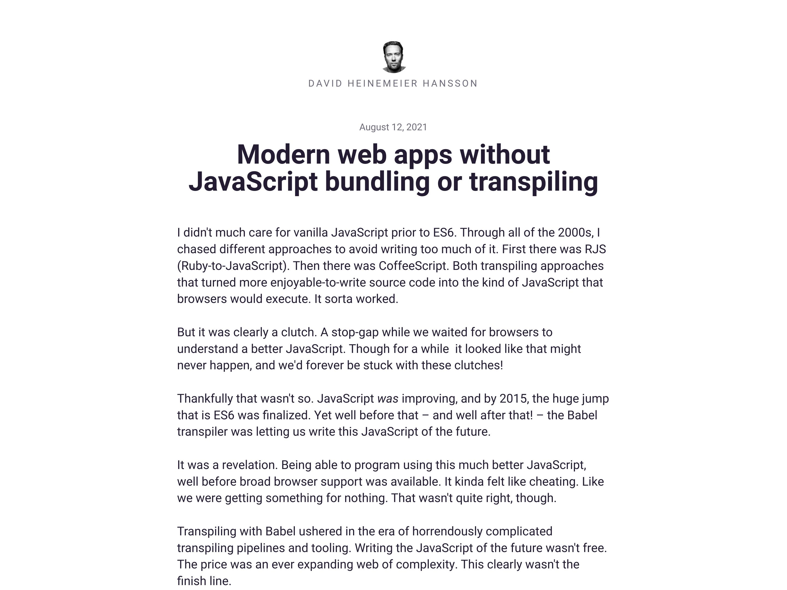

<script type="module" src="https://components.clever-cloud.com/load.js?version=7.1.0&lang=fr&components=cc-input-text"></script>

# *Mise en place d’un smart CDN* _pour distribuer des Web Components_

## poster fade-from

## blank black

## text
> @00:00:00@
🗓️ décembre 2019
> Il y a environ deux ans,
> j'étais en réunion avec mon chef,
> on discutait de mon travail et il me dit :

## text
👏 Pas mal tes composants !
> #QUENTIN#
> Bon, c'est vraiment pas mal ta bibliothèque de Web Components là !
> Mais du coup, si quelqu'un d'autre que nous veut s'en servir dans un projet Web,

## text
🤔 C'est facile à utiliser ?
> #QUENTIN#
> comment ça marche ?
> C'est facile à utiliser ?
> Du coup, j'lui réponds avec enthousiasme :

## text
🤓 Ouais, carrément !
> #HUBERT#
> Ouais, carrément !
> C'est hyper simple.

## code
```bash
npm install @clevercloud/components
```
> T'as juste à faire un npm install.
> #pause#
> Ouais... du coup...

## definition
* : Node.js 
* : npm 
> ça veut dire qu'il te faut Node.js et npm sur ta machine.

<!--
## definition
* : Yarn 
> Et si ton projet utilise yarn ou autre...
> bah...
> non mais ça devrait marcher.
-->

## code
```js
import '@clevercloud/components/dist/atoms/cc-input-text.js';
```
> Ensuite, tu vas importer les composants dont t'as besoin dans ton code source.
> #pause#
> Bon... après...
> les imports comme ça, avec un identifiant qui pointe vers npm, ça marche pas dans les navigateurs.
> Ils savent pas comment trouver AT clevercloud SLASH components machin...

## definition
* : Webpack 
* : Rollup 
* : Parcel 
* : Vite 
> Du coup, il te faut un bundler pour transformer tout ça.
> Faudra peut-être aussi ajuster la config pour bien avoir les icônes.

## definition
* : Babel 
* : TypeScript 
> Après...
> si t'utilises un transpiler genre Babel ou TypeScript,
> faudra aussi peut-être aussi ajuster la config pour gérer les bonnes syntaxes JavaScript.

## code
```js medium
// Importer le système de traductions
import { addTranslations, setLanguage } from '@clevercloud/components/dist/lib/i18n.js';


```
> Ensuite, il y a le système de traductions.
> T'importes la lib i18n,

## code
```js medium
// Importer le système de traductions
import { addTranslations, setLanguage } from '@clevercloud/components/dist/lib/i18n.js';

// Importer le fichier de traductions françaises
import * as fr from '@clevercloud/components/dist/translations/translations.fr.js';


```
> t'importes le fichier de langue qui t'intéresse,

## code
```js medium
// Importer le système de traductions
import { addTranslations, setLanguage } from '@clevercloud/components/dist/lib/i18n.js';

// Importer le fichier de traductions françaises
import * as fr from '@clevercloud/components/dist/translations/translations.fr.js';

// Charger les traductions françaises
addTranslations(fr.lang, fr.translations);


```
> tu mets un peu de boilerplate pour configurer tout ça,

## code
```js medium
// Importer le système de traductions
import { addTranslations, setLanguage } from '@clevercloud/components/dist/lib/i18n.js';

// Importer le fichier de traductions françaises
import * as fr from '@clevercloud/components/dist/translations/translations.fr.js';

// Charger les traductions françaises
addTranslations(fr.lang, fr.translations);

// Sélectionner la langue choisie par l'utilisateur
setLanguage(fr.lang);
```
> et une fois qu'c'est fait,

## code
```html
<cc-input-text value="s3cr3t" secret clipboard></cc-input-text>
```
> tu peux enfin t'servir des composants dans tes templates.

## demo-html style="font-family: Arial, sans-serif; font-size: 2em"
<cc-input-text value="s3cr3t" secret clipboard style="width: 10em"></cc-input-text>
> et admirer le résultat.

## text
😎 Trop facile !
> Tu vois, c'est pas si compliqué ?
> Là mon boss me r'garde et m'dit :

## text
😵‍💫 T'es sérieux là ?
> #QUENTIN#
> Non, mais t'es sérieux là ?
> C'est quoi cette jungle d'outils JavaScript ?
> On doit pouvoir proposer une alternative plus simple, sans tout ces npm trucs et ces Webpack machins, non ?

## code
```html
<script src="https://code.jquery.com/jquery-1.2.3.min.js"></script>
```
> On peut pas juste avoir une balise script vers un CDN,
> comme on faisait avant avec jQuery ?
> J'lui dit :

## text
😕 Euh...
> #HUBERT#
> Euh...
> Non...
> mais...
> on sait pas quels composants les gens vont utiliser,

## text
😭 Les perfs vont être nazes...
> on va avoir des perfs toutes nazes.
> Et là il me regarde en mode défi :

## text
😏 Prouve-le !
> #QUENTIN#
> Bah, vas-y, prouve-le !

## poster
> @00:02:00@
> Bonjour à *toutes* et à tous !
> J'm'appelle Hubert Sablonnière,
> J'suis développeur Web chez *Clever Cloud* et aujourd'hui, j'ai envie de vous parler du "Smart CDN" qu'on a mis en place pour exposer notre bibliothèque de Web Components.
> #Pause#

## section
Le contexte...
> J'vais commencer par vous donner un peu plus de contexte.

## media

> Ça, c'est ce qu'on appelle la console.
> C'est avec cette interface Web que nos utilisateurs gèrent les services qu'ils hébergent chez nous.
> C'est une Single Page Application avec une base de code qui a environ 10 ans.
> Du coup, la stack technique, la UI et l'UX date un peu.
> Pour faire évoluer tout ça,

## text
🙅‍♂️ Pas de refonte big bang
> on a décidé de n'pas faire de refonte big bang en recodant toute l'application from scratch,

## text
↗️ Mise à jour progressive
> mais plutôt de faire une mise à jour progressive.

## media

> Du coup, on a on a créé une bibliothèque de composants dans un projet à part (en public sur GitHub).

## text
🧱 Nouveau socle technique
> On a défini un nouveau socle technique,

## definition
* : Web Components 
* : Lit 
> C'est des Web Components développés avec la bibliothèque Lit.

<!--
## definition
* : HTML 
* : CSS 
* : JavaScript 
* : SVG 
> ça nous permet de rester très proche des standards du Web.
-->

## text
🎨 Nouvelle interface
> On part également sur des nouvelles bases pour l'interface et l'expérience utilisateur.

## media

> On expose et on documente tous ces composants avec Storybook.
> Il est dispo publiquement si vous êtes curieux.

## media

> On a des composants bas niveau type atôme : champ texte, bouton...

## media

> Mais on a aussi des composants plus haut niveau, liés à notre métier,
> comme le graph qui résume le nombre de requêtes HTTP sur la journée,

<!--
## media

> ou encore un carte qui affiche la répartition géographique des requêtes.
-->

## blank white

## media white


## media white


## media white


## media white


## media white


## media white


## definition
* : Web Components 
> Le détail important, c'est qu'on a fait le choix d'exposer des Web Components.
> Un standard du Web qui permet de dire :

## code
```js
class CcInputText extends HTMLElement {
  // ...
}
```
```js invisible
customElements.define('cc-input-text', CcInputText);
```
```html invisible
<cc-input-text value="s3cr3t" secret clipboard></cc-input-text>
```
> je définis le comportement de mon composant dans une classe,

## code
```js dim
class CcInputText extends HTMLElement {
  // ...
}
```
```js
customElements.define('cc-input-text', CcInputText);
```
```html invisible
<cc-input-text value="s3cr3t" secret clipboard></cc-input-text>
```
> J'associe cette classe à un nom de balise HTML spécifique,

## code
```js dim
class CcInputText extends HTMLElement {
  // ...
}
```
```js dim
customElements.define('cc-input-text', CcInputText);
```
```html
<cc-input-text value="s3cr3t" secret clipboard></cc-input-text>
```
> et du coup, mes utilisateurs peuvent l'utiliser comme n'importe quelle autre balise.

## text
😍 Web Components partout !

## media white


## media white


## media white


## media white


## section
Le challenge
> @00:06:00@
> avoir les meilleures perfs possible avec juste une balise script

## text
⚖️ npm install *vs.* CDN
> les bénéfices du mode DIY où on configure le bundler aux petits oignons avec que les composants dont on a besoin etc...
> mais avec la simplificé Plug & Play d'une simple balise script vers un CDN
> la question c'est à quel point on peut se rapprocher des mêmes perfs

<!--
## text
⚖️ DIY *vs.* PnP
-->

## text
⚗️ Tester, mesurer, améliorer...

<!--
## media

> on a préparé plusieurs pages types pour faire des tests

## media


## media


## media

-->

## media


## code
```html
<script src="https://code.jquery.com/jquery-1.2.3.min.js"></script>
```
> La première approche qui vient en tête, c'est de faire comme jQuery.

## text
📦 Bundle *tout-en-un*
> On fait un gros bundle avec tout dedans

## definition
* : Rollup 
> Du coup, j'ai utilisé Rollup pour construire un bundle...

## code
```html
 <!-- tous les composants (minifiés, optimisés...) + lang EN -->
 <script src="https://cdn.example.com/clever-components-1.2.3.min.js"></script> 
```
> avec tous les composants minifiés et optimisés et uniquement la langue anglais

## media

> On va regarder ce que ça donne sur l'exemple qui utilise le plus de code
> et comparer le gros bundle vs le bundle qu'aurait généré qq1 qui fait npm install + tous les réglages de son côté

## text
📶 3G slow

## wpt-summary
Bundle tout-en-un (m3)
legend: "bundle dédié (même origine)", "bundle tout-en-un (CDN tiers)"
bytes: 189610, 189190
requests: 1, 1
time: 7.8, 9.1
> On notera que sans la compression, le mega bundle fait 645 KB alors que le custom fait 623 KB
> Brotli 4 => 188.8KB / 188.4KB
> Brotli 11 => 154 KB / 151 KB
 
## media


## wpt-summary
Bundle tout-en-un (m1)
legend: "bundle dédié (même origine)", "bundle tout-en-un (CDN tiers)"
bytes: 10430, 189190
requests: 1, 1
time: 3.0, 8.2

## blank white
> le truc, c'est qu'une bibliothèque de composant, c'est pas comme jQuery
> on ne sait pas quels composants vont être utiles à l'utilisateur
> si on fait un bundle avec tout
> potentiellement, on charge beaucoup trop de choses
> a chaque nouveau composant le bundle augmente
> on ne bénéficie pas du cache
> expliquer qu'on paie l'init de la connexion au CDN
> ...

## text
🤨 *Sans* bundling ?

## media


## text
🙏 Fichiers *à la demande*
> on part des sources brutes telle quelles + dépendances et on améliore
> Pire cas possible (sources brutes)

<!--
## code
```html
<script src="https://cdn.example.com/clever-components-1.2.3.min.js"></script>
```
-->

## code
```html medium
<script type="module">


                                                        
</script>
```

## code
```html medium
<script type="module">
  import 'https://cdn.../1.2.3/setup-english.js';


                                                        
</script>
```

## code
```html medium
<script type="module">
  import 'https://cdn.../1.2.3/setup-english.js';

  import 'https://cdn.../1.2.3/cc-tile-instances.js';


                                                        
</script>
```

## code
```html medium
<script type="module">
  import 'https://cdn.../1.2.3/setup-english.js';

  import 'https://cdn.../1.2.3/cc-tile-instances.js';
  import 'https://cdn.../1.2.3/cc-tile-scalability.js';


                                                        
</script>
```

## code
```html medium
<script type="module">
  import 'https://cdn.../1.2.3/setup-english.js';

  import 'https://cdn.../1.2.3/cc-tile-instances.js';
  import 'https://cdn.../1.2.3/cc-tile-scalability.js';
  import 'https://cdn.../1.2.3/cc-tile-deployments.js';
  import 'https://cdn.../1.2.3/cc-tile-consumption.js';
  import 'https://cdn.../1.2.3/cc-tile-requests.js';
  import 'https://cdn.../1.2.3/cc-tile-status-codes.js';
  import 'https://cdn.../1.2.3/cc-logsmap.js';
</script>
```

## media contain


## wpt-summary
Fichiers à la demande
legend: "bundle dédié *", "fichiers à la demande **"
bytes: 189610, 1560000
requests: 1, 64
time: 7.8, 42.9
> Bon les perfs sont dégeu,
> mais j'ai fait exprès de prendre le pire cas possible pour qu'on voit l'impact de chaque étape
> préciser le build rollup pour transformer les bare imports

## wpt-summary
Fichiers à la demande
legend: "bundle dédié (réglages optimisés)", "fichiers à la demande (pires réglages possibles)"
bytes: 189610, 1560000
requests: 1, 64
time: 7.8, 42.9

## blank white

## definition animation
HTTP/2 (multiplexing)

## definition logo
HTTP/2 (multiplexing)


## wpt-summary
<!--multiple three : sources minifiées (http1.1, brotli) vs sources minifiées (http/2, brotli)-->
HTTP/2 (multiplexing)
legend: "HTTP 1.1", "HTTP/2"
bytes: 1560000, 1560000
requests: 64, 64
time: 42.9, 40.0

## media contain


## blank white

## definition animation
Compression

## definition logo
Compression


## wpt-summary
Compression
legend: "sans compression", "compression brotli (level ~4)"
bytes: 1560000, 461380
requests: 64, 64
time: 40.0, 14.5

## definition animation
Minification

## definition logo
Minification


## wpt-summary
Minification
legend: "sans minification", "JS minifié"
bytes: 461380, 263380
requests: 64, 64
time: 14.5, 10.7

## wpt-summary
Minification
legend: "sans minification", "JS minifié", "HTML+CSS+JS+SVG minifié"
bytes: 461380, 263380, 259070
requests: 64, 64, 64
time: 14.5, 10.7, 10.6

## section
Le challenge : level 2

## definition animation
Tree shaking

## definition logo
Tree shaking


## wpt-summary
Tree shaking
legend: "sans treeshaking", "treeshaking"
bytes: 259070, 255190
requests: 64, 60
time: 10.6, 10.5

## wpt-summary
Tree shaking
legend: "sans treeshaking", "treeshaking", "treeshaking + shim"
bytes: 259070, 255190, 232220
requests: 64, 60, 58
time: 10.6, 10.5, 10.0

## definition animation
Code splitting (chunks)

## definition logo
Code splitting (chunks)


## wpt-summary
Code splitting (chunks)
<!--multiple three : sources minifiées + tree shaking (http/2, brotli) vs sources minifiées + tree shaking + chunk (http/2, brotli)-->
legend: "sans chunk", "chunks auto"
bytes: 232220, 203420
requests: 58, 30
time: 10.0, 9.4

## wpt-summary
Code splitting (chunks)
<!--multiple three : sources minifiées + tree shaking (http/2, brotli) vs sources minifiées + tree shaking + chunk (http/2, brotli)-->
legend: "sans chunk", "chunks auto", "chunks manuels"
bytes: 232220, 203420, 199350
requests: 58, 30, 26
time: 10.0, 9.4, 9.5

## blank white

## text
⚖️ npm install *vs.* CDN
> @00:19:00@

## media


## wpt-summary
Fichiers à la demande (m3)
legend: "bundle dédié", "fichiers à la demande"
bytes: 189610, 199350
requests: 1, 26
time: 7.8, 9.5

## media


## wpt-summary
Fichiers à la demande (m1)
legend: "bundle dédié", "fichiers à la demande"
bytes: 10430, 13740
requests: 1, 5
time: 3, 5.3

## text
📶 Réseau *non bridé*

## wpt-summary
Fichiers à la demande (m3)
legend: "bundle dédié (réseau non bridé)", "fichiers à la demande (réseau non bridé)"
bytes: 189610, 199350
requests: 1, 26
time: 0.7, 1.2

## wpt-summary
Fichiers à la demande (m1)
legend: "bundle dédié (réseau non bridé)", "fichiers à la demande (réseau non bridé)"
bytes: 10430, 13740
requests: 1, 5
time: 0.2, 0.3

## text
😑 Mouais...
> Moi j'crois qu'on peut encore faire mieux

## section
Le challenge : Tokyo Drift

## media contain


## media contain


## definition animation
Import hoisting

## definition logo
Import hoisting


## code
```bash
                           
1  setup-english.js


                           
```

## code
```bash
                           
1  setup-english.js
2  └── i18n.js


                           
```

## code
```bash
                           
1  setup-english.js
2  ├── i18n.js
3  └── translations.en.js

                           
```

## code
```bash
                           
1  setup-english.js
2  ├── i18n.js
3  └── translations.en.js
4      └── i18n-sanitize.js
                           
```

## code
```bash
                           
1  setup-english.js
2  i18n.js
3  translations.en.js
4  i18n-sanitize.js
                           
```

## code
```bash
                           
4  i18n-sanitize.js
3  translations.en.js
2  i18n.js
1  setup-english.js
                           
```

## wpt-summary
Import hoisting
legend: "pas d'import hoisting", "import hoisting via Rollup"
bytes: 199350, 199350
requests: 26, 26
time: 9.5, 9.7

## code
```html medium
<script type="module">
  import 'https://cdn.../1.2.3/setup-english.js';
  import 'https://cdn.../1.2.3/cc-tile-instances.js';
  import 'https://cdn.../1.2.3/cc-tile-scalability.js';
  import 'https://cdn.../1.2.3/cc-tile-deployments.js';
  import 'https://cdn.../1.2.3/cc-tile-consumption.js';
  import 'https://cdn.../1.2.3/cc-tile-requests.js';
  import 'https://cdn.../1.2.3/cc-tile-status-codes.js';
  import 'https://cdn.../1.2.3/cc-logsmap.js';
</script>
```

## code
```html tiny
<script type="module">


  import 'https://cdn.../1.2.3/setup-english.js';
                                                            


  import 'https://cdn.../1.2.3/cc-tile-instances.js';
  import 'https://cdn.../1.2.3/cc-tile-scalability.js';

  import 'https://cdn.../1.2.3/cc-tile-deployments.js';
  import 'https://cdn.../1.2.3/cc-tile-consumption.js';


  import 'https://cdn.../1.2.3/cc-tile-requests.js';
  import 'https://cdn.../1.2.3/cc-tile-status-codes.js';


  import 'https://cdn.../1.2.3/cc-logsmap.js';
</script>
```

## code
```html tiny
<script type="module">
      import 'https://cdn.../1.2.3/i18n.js';
      import 'https://cdn.../1.2.3/i18n-sanitize.js';
      import 'https://cdn.../1.2.3/translations.en.js';
  import 'https://cdn.../1.2.3/setup-english.js';
      import 'https://cdn.../1.2.3/vendor.js';
      import 'https://cdn.../1.2.3/cc-loader.js';
      import 'https://cdn.../1.2.3/cc-expand.js';
      import 'https://cdn.../1.2.3/cc-button.js';
      import 'https://cdn.../1.2.3/cc-error.js';
      import 'https://cdn.../1.2.3/info-tiles.js';
  import 'https://cdn.../1.2.3/cc-tile-instances.js';
  import 'https://cdn.../1.2.3/cc-tile-scalability.js';
      import 'https://cdn.../1.2.3/cc-datetime-relative.js';
  import 'https://cdn.../1.2.3/cc-tile-deployments.js';
  import 'https://cdn.../1.2.3/cc-tile-consumption.js';
      import 'https://cdn.../1.2.3/_commonjsHelpers.js';
      import 'https://cdn.../1.2.3/with-resize-observer.js';
      import 'https://cdn.../1.2.3/Chart.js';
  import 'https://cdn.../1.2.3/cc-tile-requests.js';
  import 'https://cdn.../1.2.3/cc-tile-status-codes.js';
      import 'https://cdn.../1.2.3/repeat.js';
      import 'https://cdn.../1.2.3/cc-toggle.js';
      import 'https://cdn.../1.2.3/cc-map-marker-dot.js';
      import 'https://cdn.../1.2.3/cc-map.js';
  import 'https://cdn.../1.2.3/cc-logsmap.js';
</script>
```

## media contain


## wpt-summary
Import hoisting
legend: "pas d'import hoisting", "import hoisting via Rollup", "import hoisting manuel"
bytes: 199350, 199350, 199350
requests: 26, 26, 26
time: 9.5, 9.7, 9.5

## todo
video fichier à la demande hoist2

## media contain
<video src="src/videos/wpt-bilan-m3-custom-vs-a-la-demande.mp4" controls></video>

## code
```html tiny
<script type="module">
      import 'https://cdn.../1.2.3/i18n.js';
      import 'https://cdn.../1.2.3/i18n-sanitize.js';
      import 'https://cdn.../1.2.3/translations.en.js';
  import 'https://cdn.../1.2.3/setup-english.js';
      import 'https://cdn.../1.2.3/vendor.js';
      import 'https://cdn.../1.2.3/cc-loader.js';
      import 'https://cdn.../1.2.3/cc-expand.js';
      import 'https://cdn.../1.2.3/cc-button.js';
      import 'https://cdn.../1.2.3/cc-error.js';
      import 'https://cdn.../1.2.3/info-tiles.js';
  import 'https://cdn.../1.2.3/cc-tile-instances.js';
  import 'https://cdn.../1.2.3/cc-tile-scalability.js';
      import 'https://cdn.../1.2.3/cc-datetime-relative.js'; 
  import 'https://cdn.../1.2.3/cc-tile-deployments.js';
  import 'https://cdn.../1.2.3/cc-tile-consumption.js';
      import 'https://cdn.../1.2.3/_commonjsHelpers.js';
      import 'https://cdn.../1.2.3/with-resize-observer.js';
      import 'https://cdn.../1.2.3/Chart.js';
  import 'https://cdn.../1.2.3/cc-tile-requests.js';
  import 'https://cdn.../1.2.3/cc-tile-status-codes.js';
      import 'https://cdn.../1.2.3/repeat.js';
      import 'https://cdn.../1.2.3/cc-toggle.js';
      import 'https://cdn.../1.2.3/cc-map-marker-dot.js';
      import 'https://cdn.../1.2.3/cc-map.js';
  import 'https://cdn.../1.2.3/cc-logsmap.js';
</script>
```

## code
```html tiny
<script type="module">
      import('https://cdn.../1.2.3/i18n.js');
      import('https://cdn.../1.2.3/i18n-sanitize.js');
      import('https://cdn.../1.2.3/translations.en.js');
  import('https://cdn.../1.2.3/setup-english.js');
      import('https://cdn.../1.2.3/vendor.js');
      import('https://cdn.../1.2.3/cc-loader.js');
      import('https://cdn.../1.2.3/cc-expand.js');
      import('https://cdn.../1.2.3/cc-button.js');
      import('https://cdn.../1.2.3/cc-error.js');
      import('https://cdn.../1.2.3/info-tiles.js');
  import('https://cdn.../1.2.3/cc-tile-instances.js');
  import('https://cdn.../1.2.3/cc-tile-scalability.js');
      import('https://cdn.../1.2.3/cc-datetime-relative.js');
  import('https://cdn.../1.2.3/cc-tile-deployments.js');
  import('https://cdn.../1.2.3/cc-tile-consumption.js');
      import('https://cdn.../1.2.3/_commonjsHelpers.js');
      import('https://cdn.../1.2.3/with-resize-observer.js');
      import('https://cdn.../1.2.3/Chart.js');
  import('https://cdn.../1.2.3/cc-tile-requests.js');
  import('https://cdn.../1.2.3/cc-tile-status-codes.js');
      import('https://cdn.../1.2.3/repeat.js');
      import('https://cdn.../1.2.3/cc-toggle.js');
      import('https://cdn.../1.2.3/cc-map-marker-dot.js');
      import('https://cdn.../1.2.3/cc-map.js');
  import('https://cdn.../1.2.3/cc-logsmap.js');
</script>
```

## todo
mesures hoist 3

## todo
escalier hoist 3 (browser)

## todo
vidéo dédié vs hoist 3

## text
tada !!

## code
```html
<script
  type="module"
  src=" https//cdn.../load.js
    ? version = 1.2.3
    & lang = en
    & components = cc-tile-instances,
                   cc-tile-scalability,
                   cc-tile-deployments,
                   cc-tile-consumption,
                   cc-tile-requests,
                   cc-tile-status-codes,
                   cc-logsmap
  "
></script>
```

## todo
TODO
parler du cache
expliquer le endpoint dynamique
expliquer le plugin rollup + manifest
montrer la UI de sélection
montrer une démo copier/coller

## media


## code
```json
{
  "manifestVersion": "1",
  "packageVersion": "7.2.0",
  "files": [
    {}
  ]
}
```

## code
```json
{
  "id": "cc-input-text",
  "path": "cc-input-text-7c6457f7.js",
  "dependencies": [
    "vendor-5e139a4e.js",
    "i18n-446ebe81.js",
    "default-theme-fead272a.js",
    "assets/clipboard-bf8d5491.svg",
    "..."
  ],
  "sources": [
    "src/atoms/cc-input-text.js"
  ]
},
```

## code
```json
{
  "id": "",
  "path": "vendor-5e139a4e.js",
  "dependencies": [],
  "sources": [
    "node_modules/lit-html/lib/part.js",
    "node_modules/lit-element/lit-element.js",
    "...",
    "src/lib/events.js",
    "src/styles/skeleton.js",
    "src/styles/waiting.js"
  ]
},
```

## media contain

> statique
> dynamique
> pour faire ça, on va devoir analyser les dépendances

## media contain
<video src="src/videos/wpt-dedicated-vs-split-h2-min-br-hoist2.mp4" controls></video>

## code
```js
// config i18n
import './i18n.js'
// import components (dynamic)
import('./component-three.js');
import('./component-two.js');
import('./component-one.js');
```

## media contain
<video src="src/videos/wpt-dedicated-vs-split-h2-min-br-hoist4.mp4" controls></video>

## media


## media


## white blank

## media


## media


## blank white
> montrer des exemples sans i18n

## blank white
> montrer des exemples AVEC i18n

## blank white
> montrer le semver

## blank white
> expliquer la subtilité ne pas avoir la version dans les chemins

## blank white
> chaque fichier est servis avec un cache
> montrer le cache (via la demo jsbin)
> y compris le load.js quand c'est possible

## media

<!-- Avantage d'avoir toutes les versions (article jake) -->

## media

> Montrer la UI de sélection et faire une démo avec JSBin

## code
```html
<script type="module" src="https://components.clever-cloud.com/load.js?magic-mode=dont-use-this-in-prod"></script>
```

## text
👩‍🔧 Admin (Play/Scala)
<!-- Contexte Clever après : maintenant, on utilise ce smart CDN sur le site WP, la doc Hugo et une app interne Play/Scala -->

## text
🎓 Documentation (Hugo)

## media

> Montrer des exemples de la doc ou du site de clever

## text
🧮 Page tarifs (WordPress)

## media

> Montrer des exemples de la doc du nouveau site de clever

## text
inconvénients
> + lent avec une mauvaise connexion
> risque de doublons si usage de lit, charts.js, leaflet...
> (mais bon 4 fois lodash)

## section
Conclusion
> déplacement de la responsabilité et la connaissance "bundling/build"
> simplication de l'usage
> pizza maison vs surgelé

## text
💡 Idées
> Remise en contexte des techniques WebPerf JS

## text
🛠️ Techniques (serveur et build)
> Remise en contexte des techniques WebPerf JS

## text
🧰️ Design system<br>bibliothèque composants
> Remise en contexte des techniques WebPerf JS

## todo
schéma déplacement responsabilité

## text
🚨️ Il n'y a pas que <br>le JavaScript dans la vie

## blank
> C'est pas parce qu'on baigne dans cette jungle d'outil JS qu'on doit l'imposer à tout le monde

## poster
*Merci beaucoup !* _vous êtes un super public..._

## credits

Liens :

* Source des composants : https://github.com/CleverCloud/clever-components
* Storybook des composants : https://www.clever-cloud.com/doc/clever-components/
* UI pour sélectionner : https://components.clever-cloud.com/
* Smart CDN source : https://github.com/CleverCloud/clever-components-cdn

* Références :

* Panneaux code de la route : https://fr.wikibooks.org/wiki/Code_de_la_route/Liste_des_panneaux

Images :

* Fond jungle : https://www.vexels.com/vectors/preview/70035/tropical-frame-styled-jungle-background
* Calendrier 2021 : https://unsplash.com/photos/F32jPy9SMaw
* Pangolin : https://unsplash.com/photos/mtTpAM2uaRM
* Antenne : https://unsplash.com/photos/31JqyCVndUM
* QR code : https://unsplash.com/photos/2HWkORIX3II
* Fond fête : https://www.vecteezy.com/vector-art/237001-party-crowd

Polices :

* Tintin : https://www.cufonfonts.com/font/tintin
* PT Sans : https://fonts.google.com/specimen/PT+Sans
* Anton : https://fonts.google.com/specimen/Anton
* Yanone Kaffeesatz : https://fonts.google.com/specimen/Yanone+Kaffeesatz
* Skranji : https://www.fontsc.com/font/skranji

Sons :

* Marimba note : https://www.youtube.com/watch?v=8FJMTJmuoU8
* Horn sound effect : https://www.youtube.com/watch?v=gKz1X2rn3CQ
* Forest sound : https://www.youtube.com/watch?v=IsPBplWLImI

## text
🧐 CDN existants ?

## media


## media


## media


## media


## media


## text
😟 Domaine/origine tiers
